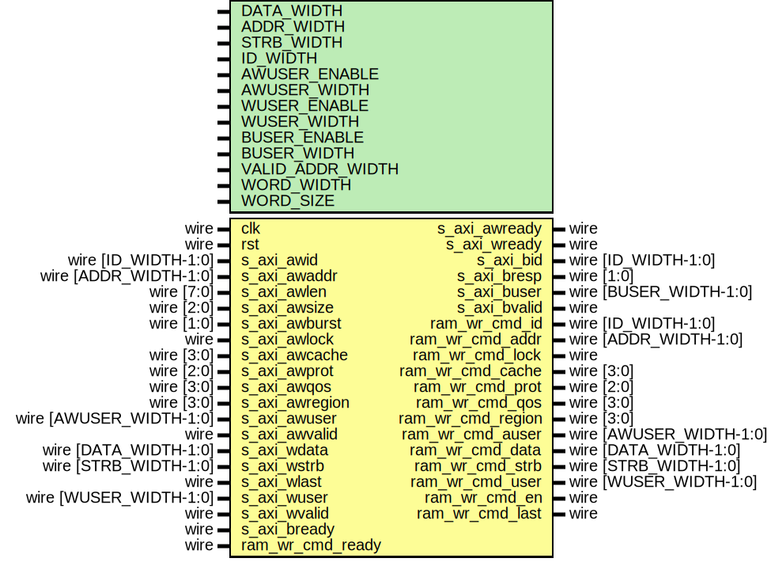

# Entity: axi_ram_wr_if

- **File**: axi_ram_wr_if.v
## Diagram

## Description

Language: Verilog 2001
 
## Generics

| Generic name     | Type | Value                           | Description                                  |
| ---------------- | ---- | ------------------------------- | -------------------------------------------- |
| DATA_WIDTH       |      | 32                              | Width of data bus in bits                    |
| ADDR_WIDTH       |      | 16                              | Width of address bus in bits                 |
| STRB_WIDTH       |      | undefined                       | Width of wstrb (width of data bus in words)  |
| ID_WIDTH         |      | 8                               | Width of ID signal                           |
| AWUSER_ENABLE    |      | 0                               | Propagate awuser signal                      |
| AWUSER_WIDTH     |      | 1                               | Width of awuser signal                       |
| WUSER_ENABLE     |      | 0                               | Propagate wuser signal                       |
| WUSER_WIDTH      |      | 1                               | Width of wuser signal                        |
| BUSER_ENABLE     |      | 0                               | Propagate buser signal                       |
| BUSER_WIDTH      |      | 1                               | Width of buser signal                        |
| VALID_ADDR_WIDTH |      | ADDR_WIDTH - $clog2(STRB_WIDTH) |                                              |
| WORD_WIDTH       |      | STRB_WIDTH                      |                                              |
| WORD_SIZE        |      | DATA_WIDTH/WORD_WIDTH           |                                              |
## Ports

| Port name         | Direction | Type                    | Description |
| ----------------- | --------- | ----------------------- | ----------- |
| clk               | input     | wire                    |             |
| rst               | input     | wire                    |             |
| s_axi_awid        | input     | wire [ID_WIDTH-1:0]     |             |
| s_axi_awaddr      | input     | wire [ADDR_WIDTH-1:0]   |             |
| s_axi_awlen       | input     | wire [7:0]              |             |
| s_axi_awsize      | input     | wire [2:0]              |             |
| s_axi_awburst     | input     | wire [1:0]              |             |
| s_axi_awlock      | input     | wire                    |             |
| s_axi_awcache     | input     | wire [3:0]              |             |
| s_axi_awprot      | input     | wire [2:0]              |             |
| s_axi_awqos       | input     | wire [3:0]              |             |
| s_axi_awregion    | input     | wire [3:0]              |             |
| s_axi_awuser      | input     | wire [AWUSER_WIDTH-1:0] |             |
| s_axi_awvalid     | input     | wire                    |             |
| s_axi_awready     | output    | wire                    |             |
| s_axi_wdata       | input     | wire [DATA_WIDTH-1:0]   |             |
| s_axi_wstrb       | input     | wire [STRB_WIDTH-1:0]   |             |
| s_axi_wlast       | input     | wire                    |             |
| s_axi_wuser       | input     | wire [WUSER_WIDTH-1:0]  |             |
| s_axi_wvalid      | input     | wire                    |             |
| s_axi_wready      | output    | wire                    |             |
| s_axi_bid         | output    | wire [ID_WIDTH-1:0]     |             |
| s_axi_bresp       | output    | wire [1:0]              |             |
| s_axi_buser       | output    | wire [BUSER_WIDTH-1:0]  |             |
| s_axi_bvalid      | output    | wire                    |             |
| s_axi_bready      | input     | wire                    |             |
| ram_wr_cmd_id     | output    | wire [ID_WIDTH-1:0]     |             |
| ram_wr_cmd_addr   | output    | wire [ADDR_WIDTH-1:0]   |             |
| ram_wr_cmd_lock   | output    | wire                    |             |
| ram_wr_cmd_cache  | output    | wire [3:0]              |             |
| ram_wr_cmd_prot   | output    | wire [2:0]              |             |
| ram_wr_cmd_qos    | output    | wire [3:0]              |             |
| ram_wr_cmd_region | output    | wire [3:0]              |             |
| ram_wr_cmd_auser  | output    | wire [AWUSER_WIDTH-1:0] |             |
| ram_wr_cmd_data   | output    | wire [DATA_WIDTH-1:0]   |             |
| ram_wr_cmd_strb   | output    | wire [STRB_WIDTH-1:0]   |             |
| ram_wr_cmd_user   | output    | wire [WUSER_WIDTH-1:0]  |             |
| ram_wr_cmd_en     | output    | wire                    |             |
| ram_wr_cmd_last   | output    | wire                    |             |
| ram_wr_cmd_ready  | input     | wire                    |             |
## Signals

| Name                  | Type                   | Description |
| --------------------- | ---------------------- | ----------- |
| state_reg             | reg [1:0]              |             |
| state_next            | reg [1:0]              |             |
| write_id_reg          | reg [ID_WIDTH-1:0]     |             |
| write_id_next         | reg [ID_WIDTH-1:0]     |             |
| write_addr_reg        | reg [ADDR_WIDTH-1:0]   |             |
| write_addr_next       | reg [ADDR_WIDTH-1:0]   |             |
| write_lock_reg        | reg                    |             |
| write_lock_next       | reg                    |             |
| write_cache_reg       | reg [3:0]              |             |
| write_cache_next      | reg [3:0]              |             |
| write_prot_reg        | reg [2:0]              |             |
| write_prot_next       | reg [2:0]              |             |
| write_qos_reg         | reg [3:0]              |             |
| write_qos_next        | reg [3:0]              |             |
| write_region_reg      | reg [3:0]              |             |
| write_region_next     | reg [3:0]              |             |
| write_awuser_reg      | reg [AWUSER_WIDTH-1:0] |             |
| write_awuser_next     | reg [AWUSER_WIDTH-1:0] |             |
| write_addr_valid_reg  | reg                    |             |
| write_addr_valid_next | reg                    |             |
| write_last_reg        | reg                    |             |
| write_last_next       | reg                    |             |
| write_count_reg       | reg [7:0]              |             |
| write_count_next      | reg [7:0]              |             |
| write_size_reg        | reg [2:0]              |             |
| write_size_next       | reg [2:0]              |             |
| write_burst_reg       | reg [1:0]              |             |
| write_burst_next      | reg [1:0]              |             |
| s_axi_awready_reg     | reg                    |             |
| s_axi_awready_next    | reg                    |             |
| s_axi_bid_reg         | reg [ID_WIDTH-1:0]     |             |
| s_axi_bid_next        | reg [ID_WIDTH-1:0]     |             |
| s_axi_bvalid_reg      | reg                    |             |
| s_axi_bvalid_next     | reg                    |             |
## Constants

| Name        | Type  | Value | Description |
| ----------- | ----- | ----- | ----------- |
| STATE_IDLE  | [1:0] | 2'd0  |             |
| STATE_BURST | [1:0] | 2'd1  |             |
| STATE_RESP  | [1:0] | 2'd2  |             |
## Processes
- unnamed: ( @* )
- unnamed: ( @(posedge clk) )
