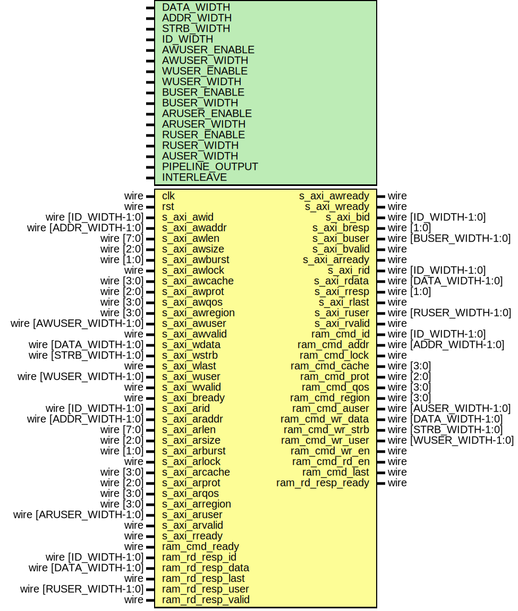

# Entity: axi_ram_wr_rd_if

- **File**: axi_ram_wr_rd_if.v
## Diagram

## Description

 Language: Verilog 2001

## Generics

| Generic name    | Type | Value        | Description                                   |
| --------------- | ---- | ------------ | --------------------------------------------- |
| DATA_WIDTH      |      | 32           |  Width of data bus in bits                    |
| ADDR_WIDTH      |      | 16           |  Width of address bus in bits                 |
| STRB_WIDTH      |      | undefined    |  Width of wstrb (width of data bus in words)  |
| ID_WIDTH        |      | 8            |  Width of ID signal                           |
| AWUSER_ENABLE   |      | 0            |  Propagate awuser signal                      |
| AWUSER_WIDTH    |      | 1            |  Width of awuser signal                       |
| WUSER_ENABLE    |      | 0            |  Propagate wuser signal                       |
| WUSER_WIDTH     |      | 1            |  Width of wuser signal                        |
| BUSER_ENABLE    |      | 0            |  Propagate buser signal                       |
| BUSER_WIDTH     |      | 1            |  Width of buser signal                        |
| ARUSER_ENABLE   |      | 0            |  Propagate aruser signal                      |
| ARUSER_WIDTH    |      | 1            |  Width of aruser signal                       |
| RUSER_ENABLE    |      | 0            |  Propagate ruser signal                       |
| RUSER_WIDTH     |      | 1            |  Width of ruser signal                        |
| AUSER_WIDTH     |      | ARUSER_WIDTH |  Width of auser output                        |
| PIPELINE_OUTPUT |      | 0            |  Extra pipeline register on output            |
| INTERLEAVE      |      | 0            |  Interleave read and write burst cycles       |
## Ports

| Port name         | Direction | Type                    | Description                         |
| ----------------- | --------- | ----------------------- | ----------------------------------- |
| clk               | input     | wire                    |                                     |
| rst               | input     | wire                    |                                     |
| s_axi_awid        | input     | wire [ID_WIDTH-1:0]     |      * AXI slave interface      */  |
| s_axi_awaddr      | input     | wire [ADDR_WIDTH-1:0]   |                                     |
| s_axi_awlen       | input     | wire [7:0]              |                                     |
| s_axi_awsize      | input     | wire [2:0]              |                                     |
| s_axi_awburst     | input     | wire [1:0]              |                                     |
| s_axi_awlock      | input     | wire                    |                                     |
| s_axi_awcache     | input     | wire [3:0]              |                                     |
| s_axi_awprot      | input     | wire [2:0]              |                                     |
| s_axi_awqos       | input     | wire [3:0]              |                                     |
| s_axi_awregion    | input     | wire [3:0]              |                                     |
| s_axi_awuser      | input     | wire [AWUSER_WIDTH-1:0] |                                     |
| s_axi_awvalid     | input     | wire                    |                                     |
| s_axi_awready     | output    | wire                    |                                     |
| s_axi_wdata       | input     | wire [DATA_WIDTH-1:0]   |                                     |
| s_axi_wstrb       | input     | wire [STRB_WIDTH-1:0]   |                                     |
| s_axi_wlast       | input     | wire                    |                                     |
| s_axi_wuser       | input     | wire [WUSER_WIDTH-1:0]  |                                     |
| s_axi_wvalid      | input     | wire                    |                                     |
| s_axi_wready      | output    | wire                    |                                     |
| s_axi_bid         | output    | wire [ID_WIDTH-1:0]     |                                     |
| s_axi_bresp       | output    | wire [1:0]              |                                     |
| s_axi_buser       | output    | wire [BUSER_WIDTH-1:0]  |                                     |
| s_axi_bvalid      | output    | wire                    |                                     |
| s_axi_bready      | input     | wire                    |                                     |
| s_axi_arid        | input     | wire [ID_WIDTH-1:0]     |                                     |
| s_axi_araddr      | input     | wire [ADDR_WIDTH-1:0]   |                                     |
| s_axi_arlen       | input     | wire [7:0]              |                                     |
| s_axi_arsize      | input     | wire [2:0]              |                                     |
| s_axi_arburst     | input     | wire [1:0]              |                                     |
| s_axi_arlock      | input     | wire                    |                                     |
| s_axi_arcache     | input     | wire [3:0]              |                                     |
| s_axi_arprot      | input     | wire [2:0]              |                                     |
| s_axi_arqos       | input     | wire [3:0]              |                                     |
| s_axi_arregion    | input     | wire [3:0]              |                                     |
| s_axi_aruser      | input     | wire [ARUSER_WIDTH-1:0] |                                     |
| s_axi_arvalid     | input     | wire                    |                                     |
| s_axi_arready     | output    | wire                    |                                     |
| s_axi_rid         | output    | wire [ID_WIDTH-1:0]     |                                     |
| s_axi_rdata       | output    | wire [DATA_WIDTH-1:0]   |                                     |
| s_axi_rresp       | output    | wire [1:0]              |                                     |
| s_axi_rlast       | output    | wire                    |                                     |
| s_axi_ruser       | output    | wire [RUSER_WIDTH-1:0]  |                                     |
| s_axi_rvalid      | output    | wire                    |                                     |
| s_axi_rready      | input     | wire                    |                                     |
| ram_cmd_id        | output    | wire [ID_WIDTH-1:0]     |      * RAM interface      */        |
| ram_cmd_addr      | output    | wire [ADDR_WIDTH-1:0]   |                                     |
| ram_cmd_lock      | output    | wire                    |                                     |
| ram_cmd_cache     | output    | wire [3:0]              |                                     |
| ram_cmd_prot      | output    | wire [2:0]              |                                     |
| ram_cmd_qos       | output    | wire [3:0]              |                                     |
| ram_cmd_region    | output    | wire [3:0]              |                                     |
| ram_cmd_auser     | output    | wire [AUSER_WIDTH-1:0]  |                                     |
| ram_cmd_wr_data   | output    | wire [DATA_WIDTH-1:0]   |                                     |
| ram_cmd_wr_strb   | output    | wire [STRB_WIDTH-1:0]   |                                     |
| ram_cmd_wr_user   | output    | wire [WUSER_WIDTH-1:0]  |                                     |
| ram_cmd_wr_en     | output    | wire                    |                                     |
| ram_cmd_rd_en     | output    | wire                    |                                     |
| ram_cmd_last      | output    | wire                    |                                     |
| ram_cmd_ready     | input     | wire                    |                                     |
| ram_rd_resp_id    | input     | wire [ID_WIDTH-1:0]     |                                     |
| ram_rd_resp_data  | input     | wire [DATA_WIDTH-1:0]   |                                     |
| ram_rd_resp_last  | input     | wire                    |                                     |
| ram_rd_resp_user  | input     | wire [RUSER_WIDTH-1:0]  |                                     |
| ram_rd_resp_valid | input     | wire                    |                                     |
| ram_rd_resp_ready | output    | wire                    |                                     |
## Signals

| Name              | Type                    | Description   |
| ----------------- | ----------------------- | ------------- |
| ram_wr_cmd_id     | wire [ID_WIDTH-1:0]     |               |
| ram_wr_cmd_addr   | wire [ADDR_WIDTH-1:0]   |               |
| ram_wr_cmd_lock   | wire                    |               |
| ram_wr_cmd_cache  | wire [3:0]              |               |
| ram_wr_cmd_prot   | wire [2:0]              |               |
| ram_wr_cmd_qos    | wire [3:0]              |               |
| ram_wr_cmd_region | wire [3:0]              |               |
| ram_wr_cmd_auser  | wire [AWUSER_WIDTH-1:0] |               |
| ram_rd_cmd_id     | wire [ID_WIDTH-1:0]     |               |
| ram_rd_cmd_addr   | wire [ADDR_WIDTH-1:0]   |               |
| ram_rd_cmd_lock   | wire                    |               |
| ram_rd_cmd_cache  | wire [3:0]              |               |
| ram_rd_cmd_prot   | wire [2:0]              |               |
| ram_rd_cmd_qos    | wire [3:0]              |               |
| ram_rd_cmd_region | wire [3:0]              |               |
| ram_rd_cmd_auser  | wire [AWUSER_WIDTH-1:0] |               |
| read_eligible     | reg                     |  arbitration  |
| write_eligible    | reg                     |               |
| write_en          | reg                     |               |
| read_en           | reg                     |               |
| last_read_reg     | reg                     |               |
| last_read_next    | reg                     |               |
| transaction_reg   | reg                     |               |
| transaction_next  | reg                     |               |
## Processes
- unnamed: ( @* )
  - **Type:** always
- unnamed: ( @(posedge clk) )
  - **Type:** always
## Instantiations

- axi_ram_wr_if_inst: axi_ram_wr_if
- axi_ram_rd_if_inst: axi_ram_rd_if
