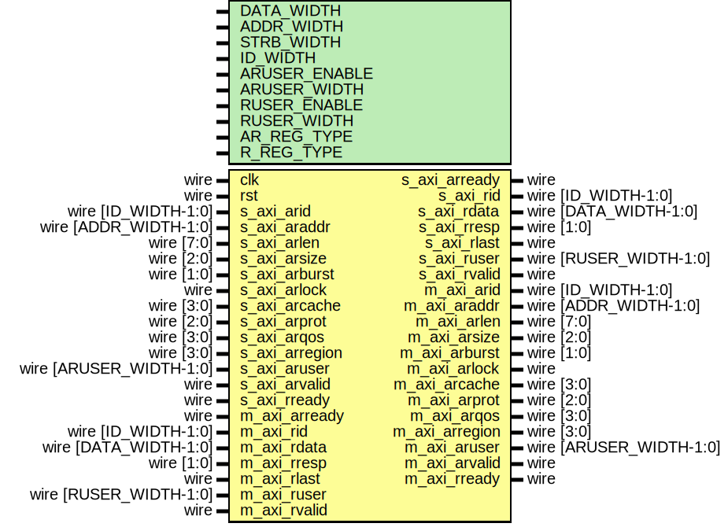

# Entity: axi_register_rd

- **File**: axi_register_rd.v
## Diagram

## Description

 Language: Verilog 2001

## Generics

| Generic name  | Type | Value     | Description                                                                     |
| ------------- | ---- | --------- | ------------------------------------------------------------------------------- |
| DATA_WIDTH    |      | 32        |  Width of data bus in bits                                                      |
| ADDR_WIDTH    |      | 32        |  Width of address bus in bits                                                   |
| STRB_WIDTH    |      | undefined |  Width of wstrb (width of data bus in words)                                    |
| ID_WIDTH      |      | 8         |  Width of ID signal                                                             |
| ARUSER_ENABLE |      | 0         |  Propagate aruser signal                                                        |
| ARUSER_WIDTH  |      | 1         |  Width of aruser signal                                                         |
| RUSER_ENABLE  |      | 0         |  Propagate ruser signal                                                         |
| RUSER_WIDTH   |      | 1         |  Width of ruser signal                                                          |
| AR_REG_TYPE   |      | 1         |  AR channel register type  0 to bypass, 1 for simple buffer, 2 for skid buffer  |
| R_REG_TYPE    |      | 2         |  R channel register type  0 to bypass, 1 for simple buffer, 2 for skid buffer   |
## Ports

| Port name      | Direction | Type                    | Description                          |
| -------------- | --------- | ----------------------- | ------------------------------------ |
| clk            | input     | wire                    |                                      |
| rst            | input     | wire                    |                                      |
| s_axi_arid     | input     | wire [ID_WIDTH-1:0]     |      * AXI slave interface      */   |
| s_axi_araddr   | input     | wire [ADDR_WIDTH-1:0]   |                                      |
| s_axi_arlen    | input     | wire [7:0]              |                                      |
| s_axi_arsize   | input     | wire [2:0]              |                                      |
| s_axi_arburst  | input     | wire [1:0]              |                                      |
| s_axi_arlock   | input     | wire                    |                                      |
| s_axi_arcache  | input     | wire [3:0]              |                                      |
| s_axi_arprot   | input     | wire [2:0]              |                                      |
| s_axi_arqos    | input     | wire [3:0]              |                                      |
| s_axi_arregion | input     | wire [3:0]              |                                      |
| s_axi_aruser   | input     | wire [ARUSER_WIDTH-1:0] |                                      |
| s_axi_arvalid  | input     | wire                    |                                      |
| s_axi_arready  | output    | wire                    |                                      |
| s_axi_rid      | output    | wire [ID_WIDTH-1:0]     |                                      |
| s_axi_rdata    | output    | wire [DATA_WIDTH-1:0]   |                                      |
| s_axi_rresp    | output    | wire [1:0]              |                                      |
| s_axi_rlast    | output    | wire                    |                                      |
| s_axi_ruser    | output    | wire [RUSER_WIDTH-1:0]  |                                      |
| s_axi_rvalid   | output    | wire                    |                                      |
| s_axi_rready   | input     | wire                    |                                      |
| m_axi_arid     | output    | wire [ID_WIDTH-1:0]     |      * AXI master interface      */  |
| m_axi_araddr   | output    | wire [ADDR_WIDTH-1:0]   |                                      |
| m_axi_arlen    | output    | wire [7:0]              |                                      |
| m_axi_arsize   | output    | wire [2:0]              |                                      |
| m_axi_arburst  | output    | wire [1:0]              |                                      |
| m_axi_arlock   | output    | wire                    |                                      |
| m_axi_arcache  | output    | wire [3:0]              |                                      |
| m_axi_arprot   | output    | wire [2:0]              |                                      |
| m_axi_arqos    | output    | wire [3:0]              |                                      |
| m_axi_arregion | output    | wire [3:0]              |                                      |
| m_axi_aruser   | output    | wire [ARUSER_WIDTH-1:0] |                                      |
| m_axi_arvalid  | output    | wire                    |                                      |
| m_axi_arready  | input     | wire                    |                                      |
| m_axi_rid      | input     | wire [ID_WIDTH-1:0]     |                                      |
| m_axi_rdata    | input     | wire [DATA_WIDTH-1:0]   |                                      |
| m_axi_rresp    | input     | wire [1:0]              |                                      |
| m_axi_rlast    | input     | wire                    |                                      |
| m_axi_ruser    | input     | wire [RUSER_WIDTH-1:0]  |                                      |
| m_axi_rvalid   | input     | wire                    |                                      |
| m_axi_rready   | output    | wire                    |                                      |
