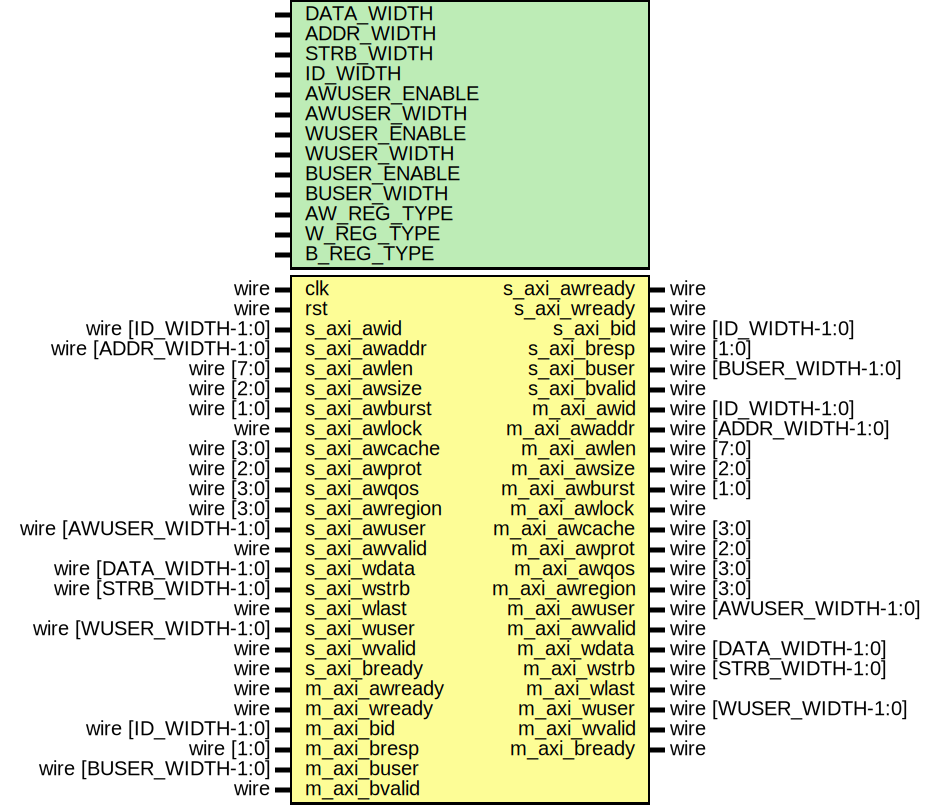

# Entity: axi_register_wr

- **File**: axi_register_wr.v
## Diagram

## Description

Language: Verilog 2001
 
## Generics

| Generic name  | Type | Value     | Description                                                                   |
| ------------- | ---- | --------- | ----------------------------------------------------------------------------- |
| DATA_WIDTH    |      | 32        | Width of data bus in bits                                                     |
| ADDR_WIDTH    |      | 32        | Width of address bus in bits                                                  |
| STRB_WIDTH    |      | undefined | Width of wstrb (width of data bus in words)                                   |
| ID_WIDTH      |      | 8         | Width of ID signal                                                            |
| AWUSER_ENABLE |      | 0         | Propagate awuser signal                                                       |
| AWUSER_WIDTH  |      | 1         | Width of awuser signal                                                        |
| WUSER_ENABLE  |      | 0         | Propagate wuser signal                                                        |
| WUSER_WIDTH   |      | 1         | Width of wuser signal                                                         |
| BUSER_ENABLE  |      | 0         | Propagate buser signal                                                        |
| BUSER_WIDTH   |      | 1         | Width of buser signal                                                         |
| AW_REG_TYPE   |      | 1         | AW channel register type 0 to bypass, 1 for simple buffer, 2 for skid buffer  |
| W_REG_TYPE    |      | 2         | W channel register type 0 to bypass, 1 for simple buffer, 2 for skid buffer   |
| B_REG_TYPE    |      | 1         | B channel register type 0 to bypass, 1 for simple buffer, 2 for skid buffer   |
## Ports

| Port name      | Direction | Type                    | Description |
| -------------- | --------- | ----------------------- | ----------- |
| clk            | input     | wire                    |             |
| rst            | input     | wire                    |             |
| s_axi_awid     | input     | wire [ID_WIDTH-1:0]     |             |
| s_axi_awaddr   | input     | wire [ADDR_WIDTH-1:0]   |             |
| s_axi_awlen    | input     | wire [7:0]              |             |
| s_axi_awsize   | input     | wire [2:0]              |             |
| s_axi_awburst  | input     | wire [1:0]              |             |
| s_axi_awlock   | input     | wire                    |             |
| s_axi_awcache  | input     | wire [3:0]              |             |
| s_axi_awprot   | input     | wire [2:0]              |             |
| s_axi_awqos    | input     | wire [3:0]              |             |
| s_axi_awregion | input     | wire [3:0]              |             |
| s_axi_awuser   | input     | wire [AWUSER_WIDTH-1:0] |             |
| s_axi_awvalid  | input     | wire                    |             |
| s_axi_awready  | output    | wire                    |             |
| s_axi_wdata    | input     | wire [DATA_WIDTH-1:0]   |             |
| s_axi_wstrb    | input     | wire [STRB_WIDTH-1:0]   |             |
| s_axi_wlast    | input     | wire                    |             |
| s_axi_wuser    | input     | wire [WUSER_WIDTH-1:0]  |             |
| s_axi_wvalid   | input     | wire                    |             |
| s_axi_wready   | output    | wire                    |             |
| s_axi_bid      | output    | wire [ID_WIDTH-1:0]     |             |
| s_axi_bresp    | output    | wire [1:0]              |             |
| s_axi_buser    | output    | wire [BUSER_WIDTH-1:0]  |             |
| s_axi_bvalid   | output    | wire                    |             |
| s_axi_bready   | input     | wire                    |             |
| m_axi_awid     | output    | wire [ID_WIDTH-1:0]     |             |
| m_axi_awaddr   | output    | wire [ADDR_WIDTH-1:0]   |             |
| m_axi_awlen    | output    | wire [7:0]              |             |
| m_axi_awsize   | output    | wire [2:0]              |             |
| m_axi_awburst  | output    | wire [1:0]              |             |
| m_axi_awlock   | output    | wire                    |             |
| m_axi_awcache  | output    | wire [3:0]              |             |
| m_axi_awprot   | output    | wire [2:0]              |             |
| m_axi_awqos    | output    | wire [3:0]              |             |
| m_axi_awregion | output    | wire [3:0]              |             |
| m_axi_awuser   | output    | wire [AWUSER_WIDTH-1:0] |             |
| m_axi_awvalid  | output    | wire                    |             |
| m_axi_awready  | input     | wire                    |             |
| m_axi_wdata    | output    | wire [DATA_WIDTH-1:0]   |             |
| m_axi_wstrb    | output    | wire [STRB_WIDTH-1:0]   |             |
| m_axi_wlast    | output    | wire                    |             |
| m_axi_wuser    | output    | wire [WUSER_WIDTH-1:0]  |             |
| m_axi_wvalid   | output    | wire                    |             |
| m_axi_wready   | input     | wire                    |             |
| m_axi_bid      | input     | wire [ID_WIDTH-1:0]     |             |
| m_axi_bresp    | input     | wire [1:0]              |             |
| m_axi_buser    | input     | wire [BUSER_WIDTH-1:0]  |             |
| m_axi_bvalid   | input     | wire                    |             |
| m_axi_bready   | output    | wire                    |             |
