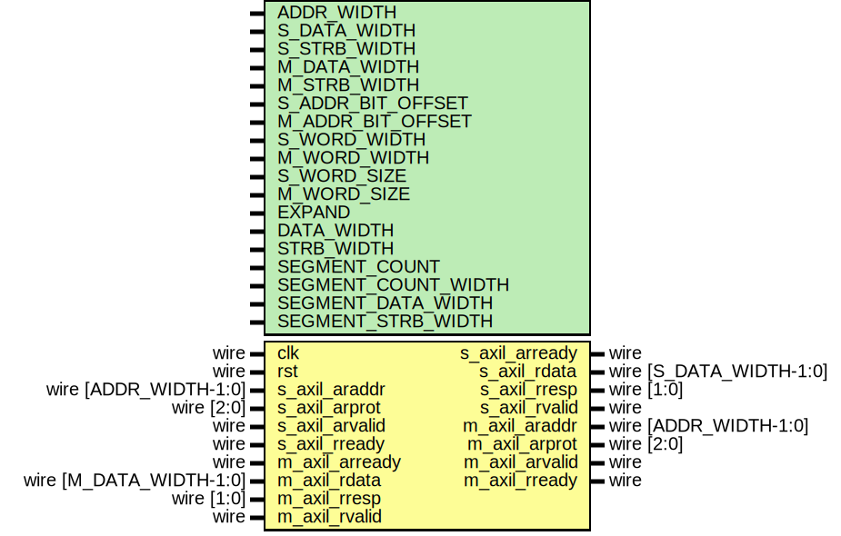

# Entity: axil_adapter_rd

- **File**: axil_adapter_rd.v
## Diagram

## Description

 Language: Verilog 2001

## Generics

| Generic name        | Type | Value                                          | Description                                                             |
| ------------------- | ---- | ---------------------------------------------- | ----------------------------------------------------------------------- |
| ADDR_WIDTH          |      | 32                                             |  Width of address bus in bits                                           |
| S_DATA_WIDTH        |      | 32                                             |  Width of input (slave) interface data bus in bits                      |
| S_STRB_WIDTH        |      | undefined                                      |  Width of input (slave) interface wstrb (width of data bus in words)    |
| M_DATA_WIDTH        |      | 32                                             |  Width of output (master) interface data bus in bits                    |
| M_STRB_WIDTH        |      | undefined                                      |  Width of output (master) interface wstrb (width of data bus in words)  |
| S_ADDR_BIT_OFFSET   |      | $clog2(S_STRB_WIDTH)                           |                                                                         |
| M_ADDR_BIT_OFFSET   |      | $clog2(M_STRB_WIDTH)                           |                                                                         |
| S_WORD_WIDTH        |      | S_STRB_WIDTH                                   |                                                                         |
| M_WORD_WIDTH        |      | M_STRB_WIDTH                                   |                                                                         |
| S_WORD_SIZE         |      | S_DATA_WIDTH/S_WORD_WIDTH                      |                                                                         |
| M_WORD_SIZE         |      | M_DATA_WIDTH/M_WORD_WIDTH                      |                                                                         |
| EXPAND              |      | M_STRB_WIDTH > S_STRB_WIDTH                    |  output bus is wider                                                    |
| DATA_WIDTH          |      | EXPAND ? M_DATA_WIDTH : S_DATA_WIDTH           |                                                                         |
| STRB_WIDTH          |      | EXPAND ? M_STRB_WIDTH : S_STRB_WIDTH           |                                                                         |
| SEGMENT_COUNT       |      | undefined                                      |  required number of segments in wider bus                               |
| SEGMENT_COUNT_WIDTH |      | SEGMENT_COUNT == 1 ? 1 : $clog2(SEGMENT_COUNT) |                                                                         |
| SEGMENT_DATA_WIDTH  |      | DATA_WIDTH / SEGMENT_COUNT                     |  data width and keep width per segment                                  |
| SEGMENT_STRB_WIDTH  |      | STRB_WIDTH / SEGMENT_COUNT                     |                                                                         |
## Ports

| Port name      | Direction | Type                    | Description                               |
| -------------- | --------- | ----------------------- | ----------------------------------------- |
| clk            | input     | wire                    |                                           |
| rst            | input     | wire                    |                                           |
| s_axil_araddr  | input     | wire [ADDR_WIDTH-1:0]   |      * AXI lite slave interface      */   |
| s_axil_arprot  | input     | wire [2:0]              |                                           |
| s_axil_arvalid | input     | wire                    |                                           |
| s_axil_arready | output    | wire                    |                                           |
| s_axil_rdata   | output    | wire [S_DATA_WIDTH-1:0] |                                           |
| s_axil_rresp   | output    | wire [1:0]              |                                           |
| s_axil_rvalid  | output    | wire                    |                                           |
| s_axil_rready  | input     | wire                    |                                           |
| m_axil_araddr  | output    | wire [ADDR_WIDTH-1:0]   |      * AXI lite master interface      */  |
| m_axil_arprot  | output    | wire [2:0]              |                                           |
| m_axil_arvalid | output    | wire                    |                                           |
| m_axil_arready | input     | wire                    |                                           |
| m_axil_rdata   | input     | wire [M_DATA_WIDTH-1:0] |                                           |
| m_axil_rresp   | input     | wire [1:0]              |                                           |
| m_axil_rvalid  | input     | wire                    |                                           |
| m_axil_rready  | output    | wire                    |                                           |
## Signals

| Name                 | Type                          | Description |
| -------------------- | ----------------------------- | ----------- |
| state_reg            | reg [0:0]                     |             |
| state_next           | reg [0:0]                     |             |
| current_segment_reg  | reg [SEGMENT_COUNT_WIDTH-1:0] |             |
| current_segment_next | reg [SEGMENT_COUNT_WIDTH-1:0] |             |
| s_axil_arready_reg   | reg                           |             |
| s_axil_arready_next  | reg                           |             |
| s_axil_rdata_reg     | reg [S_DATA_WIDTH-1:0]        |             |
| s_axil_rdata_next    | reg [S_DATA_WIDTH-1:0]        |             |
| s_axil_rresp_reg     | reg [1:0]                     |             |
| s_axil_rresp_next    | reg [1:0]                     |             |
| s_axil_rvalid_reg    | reg                           |             |
| s_axil_rvalid_next   | reg                           |             |
| m_axil_araddr_reg    | reg [ADDR_WIDTH-1:0]          |             |
| m_axil_araddr_next   | reg [ADDR_WIDTH-1:0]          |             |
| m_axil_arprot_reg    | reg [2:0]                     |             |
| m_axil_arprot_next   | reg [2:0]                     |             |
| m_axil_arvalid_reg   | reg                           |             |
| m_axil_arvalid_next  | reg                           |             |
| m_axil_rready_reg    | reg                           |             |
| m_axil_rready_next   | reg                           |             |
## Constants

| Name       | Type  | Value | Description |
| ---------- | ----- | ----- | ----------- |
| STATE_IDLE | [0:0] | 1'd0  |             |
| STATE_DATA | [0:0] | 1'd1  |             |
## Processes
- unnamed: ( @* )
  - **Type:** always
- unnamed: ( @(posedge clk) )
  - **Type:** always
