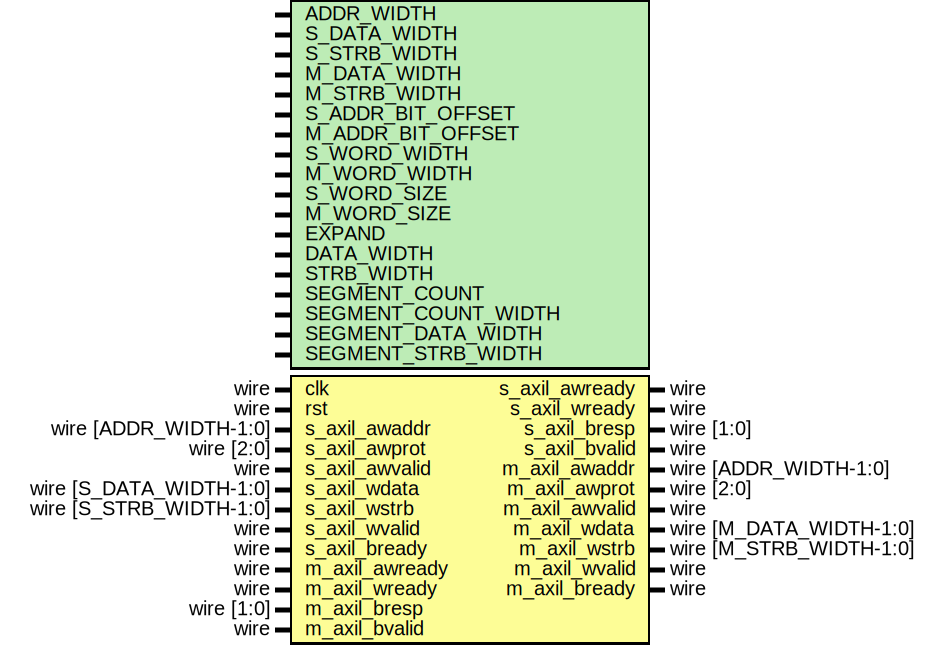

# Entity: axil_adapter_wr

- **File**: axil_adapter_wr.v
## Diagram

## Description

Language: Verilog 2001
 
## Generics

| Generic name        | Type | Value                                          | Description                                                            |
| ------------------- | ---- | ---------------------------------------------- | ---------------------------------------------------------------------- |
| ADDR_WIDTH          |      | 32                                             | Width of address bus in bits                                           |
| S_DATA_WIDTH        |      | 32                                             | Width of input (slave) interface data bus in bits                      |
| S_STRB_WIDTH        |      | undefined                                      | Width of input (slave) interface wstrb (width of data bus in words)    |
| M_DATA_WIDTH        |      | 32                                             | Width of output (master) interface data bus in bits                    |
| M_STRB_WIDTH        |      | undefined                                      | Width of output (master) interface wstrb (width of data bus in words)  |
| S_ADDR_BIT_OFFSET   |      | $clog2(S_STRB_WIDTH)                           |                                                                        |
| M_ADDR_BIT_OFFSET   |      | $clog2(M_STRB_WIDTH)                           |                                                                        |
| S_WORD_WIDTH        |      | S_STRB_WIDTH                                   |                                                                        |
| M_WORD_WIDTH        |      | M_STRB_WIDTH                                   |                                                                        |
| S_WORD_SIZE         |      | S_DATA_WIDTH/S_WORD_WIDTH                      |                                                                        |
| M_WORD_SIZE         |      | M_DATA_WIDTH/M_WORD_WIDTH                      |                                                                        |
| EXPAND              |      | M_STRB_WIDTH > S_STRB_WIDTH                    | output bus is wider                                                    |
| DATA_WIDTH          |      | EXPAND ? M_DATA_WIDTH : S_DATA_WIDTH           |                                                                        |
| STRB_WIDTH          |      | EXPAND ? M_STRB_WIDTH : S_STRB_WIDTH           |                                                                        |
| SEGMENT_COUNT       |      | undefined                                      | required number of segments in wider bus                               |
| SEGMENT_COUNT_WIDTH |      | SEGMENT_COUNT == 1 ? 1 : $clog2(SEGMENT_COUNT) |                                                                        |
| SEGMENT_DATA_WIDTH  |      | DATA_WIDTH / SEGMENT_COUNT                     | data width and keep width per segment                                  |
| SEGMENT_STRB_WIDTH  |      | STRB_WIDTH / SEGMENT_COUNT                     |                                                                        |
## Ports

| Port name      | Direction | Type                    | Description |
| -------------- | --------- | ----------------------- | ----------- |
| clk            | input     | wire                    |             |
| rst            | input     | wire                    |             |
| s_axil_awaddr  | input     | wire [ADDR_WIDTH-1:0]   |             |
| s_axil_awprot  | input     | wire [2:0]              |             |
| s_axil_awvalid | input     | wire                    |             |
| s_axil_awready | output    | wire                    |             |
| s_axil_wdata   | input     | wire [S_DATA_WIDTH-1:0] |             |
| s_axil_wstrb   | input     | wire [S_STRB_WIDTH-1:0] |             |
| s_axil_wvalid  | input     | wire                    |             |
| s_axil_wready  | output    | wire                    |             |
| s_axil_bresp   | output    | wire [1:0]              |             |
| s_axil_bvalid  | output    | wire                    |             |
| s_axil_bready  | input     | wire                    |             |
| m_axil_awaddr  | output    | wire [ADDR_WIDTH-1:0]   |             |
| m_axil_awprot  | output    | wire [2:0]              |             |
| m_axil_awvalid | output    | wire                    |             |
| m_axil_awready | input     | wire                    |             |
| m_axil_wdata   | output    | wire [M_DATA_WIDTH-1:0] |             |
| m_axil_wstrb   | output    | wire [M_STRB_WIDTH-1:0] |             |
| m_axil_wvalid  | output    | wire                    |             |
| m_axil_wready  | input     | wire                    |             |
| m_axil_bresp   | input     | wire [1:0]              |             |
| m_axil_bvalid  | input     | wire                    |             |
| m_axil_bready  | output    | wire                    |             |
## Signals

| Name                 | Type                          | Description |
| -------------------- | ----------------------------- | ----------- |
| state_reg            | reg [1:0]                     |             |
| state_next           | reg [1:0]                     |             |
| data_reg             | reg [DATA_WIDTH-1:0]          |             |
| data_next            | reg [DATA_WIDTH-1:0]          |             |
| strb_reg             | reg [STRB_WIDTH-1:0]          |             |
| strb_next            | reg [STRB_WIDTH-1:0]          |             |
| current_segment_reg  | reg [SEGMENT_COUNT_WIDTH-1:0] |             |
| current_segment_next | reg [SEGMENT_COUNT_WIDTH-1:0] |             |
| s_axil_awready_reg   | reg                           |             |
| s_axil_awready_next  | reg                           |             |
| s_axil_wready_reg    | reg                           |             |
| s_axil_wready_next   | reg                           |             |
| s_axil_bresp_reg     | reg [1:0]                     |             |
| s_axil_bresp_next    | reg [1:0]                     |             |
| s_axil_bvalid_reg    | reg                           |             |
| s_axil_bvalid_next   | reg                           |             |
| m_axil_awaddr_reg    | reg [ADDR_WIDTH-1:0]          |             |
| m_axil_awaddr_next   | reg [ADDR_WIDTH-1:0]          |             |
| m_axil_awprot_reg    | reg [2:0]                     |             |
| m_axil_awprot_next   | reg [2:0]                     |             |
| m_axil_awvalid_reg   | reg                           |             |
| m_axil_awvalid_next  | reg                           |             |
| m_axil_wdata_reg     | reg [M_DATA_WIDTH-1:0]        |             |
| m_axil_wdata_next    | reg [M_DATA_WIDTH-1:0]        |             |
| m_axil_wstrb_reg     | reg [M_STRB_WIDTH-1:0]        |             |
| m_axil_wstrb_next    | reg [M_STRB_WIDTH-1:0]        |             |
| m_axil_wvalid_reg    | reg                           |             |
| m_axil_wvalid_next   | reg                           |             |
| m_axil_bready_reg    | reg                           |             |
| m_axil_bready_next   | reg                           |             |
## Constants

| Name       | Type  | Value | Description |
| ---------- | ----- | ----- | ----------- |
| STATE_IDLE | [1:0] | 2'd0  |             |
| STATE_DATA | [1:0] | 2'd1  |             |
| STATE_RESP | [1:0] | 2'd3  |             |
## Processes
- unnamed: ( @* )
- unnamed: ( @(posedge clk) )
