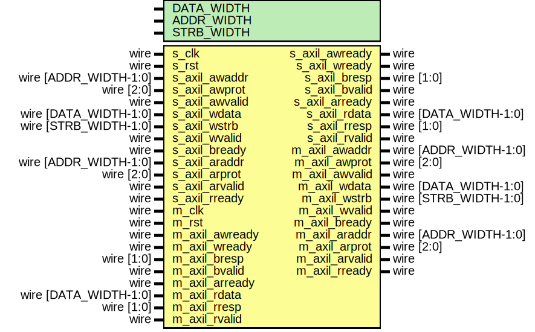

# Entity: axil_cdc

## Diagram

## Description

Language: Verilog 2001
 
## Generics

| Generic name | Type | Value     | Description                                  |
| ------------ | ---- | --------- | -------------------------------------------- |
| DATA_WIDTH   |      | 32        | Width of data bus in bits                    |
| ADDR_WIDTH   |      | 32        | Width of address bus in bits                 |
| STRB_WIDTH   |      | undefined | Width of wstrb (width of data bus in words)  |
## Ports

| Port name      | Direction | Type                  | Description |
| -------------- | --------- | --------------------- | ----------- |
| s_clk          | input     | wire                  |             |
| s_rst          | input     | wire                  |             |
| s_axil_awaddr  | input     | wire [ADDR_WIDTH-1:0] |             |
| s_axil_awprot  | input     | wire [2:0]            |             |
| s_axil_awvalid | input     | wire                  |             |
| s_axil_awready | output    | wire                  |             |
| s_axil_wdata   | input     | wire [DATA_WIDTH-1:0] |             |
| s_axil_wstrb   | input     | wire [STRB_WIDTH-1:0] |             |
| s_axil_wvalid  | input     | wire                  |             |
| s_axil_wready  | output    | wire                  |             |
| s_axil_bresp   | output    | wire [1:0]            |             |
| s_axil_bvalid  | output    | wire                  |             |
| s_axil_bready  | input     | wire                  |             |
| s_axil_araddr  | input     | wire [ADDR_WIDTH-1:0] |             |
| s_axil_arprot  | input     | wire [2:0]            |             |
| s_axil_arvalid | input     | wire                  |             |
| s_axil_arready | output    | wire                  |             |
| s_axil_rdata   | output    | wire [DATA_WIDTH-1:0] |             |
| s_axil_rresp   | output    | wire [1:0]            |             |
| s_axil_rvalid  | output    | wire                  |             |
| s_axil_rready  | input     | wire                  |             |
| m_clk          | input     | wire                  |             |
| m_rst          | input     | wire                  |             |
| m_axil_awaddr  | output    | wire [ADDR_WIDTH-1:0] |             |
| m_axil_awprot  | output    | wire [2:0]            |             |
| m_axil_awvalid | output    | wire                  |             |
| m_axil_awready | input     | wire                  |             |
| m_axil_wdata   | output    | wire [DATA_WIDTH-1:0] |             |
| m_axil_wstrb   | output    | wire [STRB_WIDTH-1:0] |             |
| m_axil_wvalid  | output    | wire                  |             |
| m_axil_wready  | input     | wire                  |             |
| m_axil_bresp   | input     | wire [1:0]            |             |
| m_axil_bvalid  | input     | wire                  |             |
| m_axil_bready  | output    | wire                  |             |
| m_axil_araddr  | output    | wire [ADDR_WIDTH-1:0] |             |
| m_axil_arprot  | output    | wire [2:0]            |             |
| m_axil_arvalid | output    | wire                  |             |
| m_axil_arready | input     | wire                  |             |
| m_axil_rdata   | input     | wire [DATA_WIDTH-1:0] |             |
| m_axil_rresp   | input     | wire [1:0]            |             |
| m_axil_rvalid  | input     | wire                  |             |
| m_axil_rready  | output    | wire                  |             |
## Instantiations

- axil_cdc_wr_inst: axil_cdc_wr
- axil_cdc_rd_inst: axil_cdc_rd
