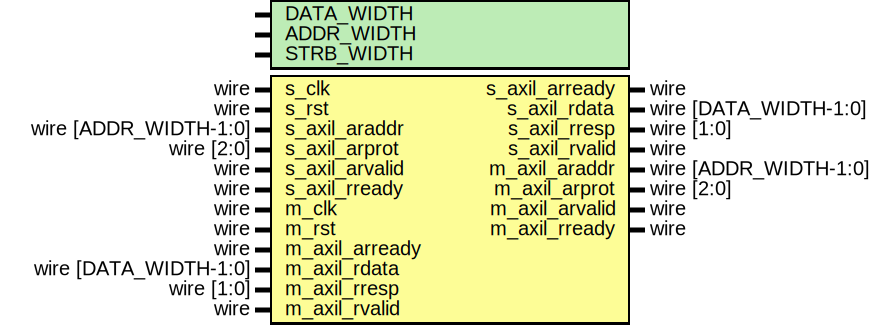
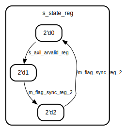
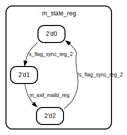

# Entity: axil_cdc_rd

## Diagram

## Description

Language: Verilog 2001
 
## Generics

| Generic name | Type | Value     | Description                                  |
| ------------ | ---- | --------- | -------------------------------------------- |
| DATA_WIDTH   |      | 32        | Width of data bus in bits                    |
| ADDR_WIDTH   |      | 32        | Width of address bus in bits                 |
| STRB_WIDTH   |      | undefined | Width of wstrb (width of data bus in words)  |
## Ports

| Port name      | Direction | Type                  | Description |
| -------------- | --------- | --------------------- | ----------- |
| s_clk          | input     | wire                  |             |
| s_rst          | input     | wire                  |             |
| s_axil_araddr  | input     | wire [ADDR_WIDTH-1:0] |             |
| s_axil_arprot  | input     | wire [2:0]            |             |
| s_axil_arvalid | input     | wire                  |             |
| s_axil_arready | output    | wire                  |             |
| s_axil_rdata   | output    | wire [DATA_WIDTH-1:0] |             |
| s_axil_rresp   | output    | wire [1:0]            |             |
| s_axil_rvalid  | output    | wire                  |             |
| s_axil_rready  | input     | wire                  |             |
| m_clk          | input     | wire                  |             |
| m_rst          | input     | wire                  |             |
| m_axil_araddr  | output    | wire [ADDR_WIDTH-1:0] |             |
| m_axil_arprot  | output    | wire [2:0]            |             |
| m_axil_arvalid | output    | wire                  |             |
| m_axil_arready | input     | wire                  |             |
| m_axil_rdata   | input     | wire [DATA_WIDTH-1:0] |             |
| m_axil_rresp   | input     | wire [1:0]            |             |
| m_axil_rvalid  | input     | wire                  |             |
| m_axil_rready  | output    | wire                  |             |
## Signals

| Name               | Type                 | Description |
| ------------------ | -------------------- | ----------- |
| s_state_reg        | reg [1:0]            |             |
| s_flag_reg         | reg                  |             |
| s_flag_sync_reg_1  | reg                  |             |
| s_flag_sync_reg_2  | reg                  |             |
| m_state_reg        | reg [1:0]            |             |
| m_flag_reg         | reg                  |             |
| m_flag_sync_reg_1  | reg                  |             |
| m_flag_sync_reg_2  | reg                  |             |
| s_axil_araddr_reg  | reg [ADDR_WIDTH-1:0] |             |
| s_axil_arprot_reg  | reg [2:0]            |             |
| s_axil_arvalid_reg | reg                  |             |
| s_axil_rdata_reg   | reg [DATA_WIDTH-1:0] |             |
| s_axil_rresp_reg   | reg [1:0]            |             |
| s_axil_rvalid_reg  | reg                  |             |
| m_axil_araddr_reg  | reg [ADDR_WIDTH-1:0] |             |
| m_axil_arprot_reg  | reg [2:0]            |             |
| m_axil_arvalid_reg | reg                  |             |
| m_axil_rdata_reg   | reg [DATA_WIDTH-1:0] |             |
| m_axil_rresp_reg   | reg [1:0]            |             |
| m_axil_rvalid_reg  | reg                  |             |
## Processes
- unnamed: ( @(posedge s_clk) )
**Description**
slave side

- unnamed: ( @(posedge s_clk) )
**Description**
synchronization

- unnamed: ( @(posedge m_clk) )
- unnamed: ( @(posedge m_clk) )
**Description**
master side

## State machines

- slave side- master side