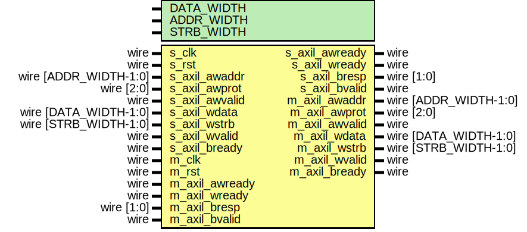
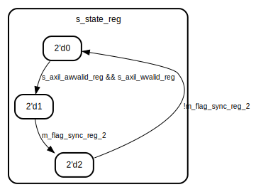
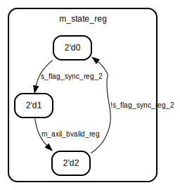

# Entity: axil_cdc_wr

## Diagram

## Description

Language: Verilog 2001
 
## Generics

| Generic name | Type | Value     | Description                                  |
| ------------ | ---- | --------- | -------------------------------------------- |
| DATA_WIDTH   |      | 32        | Width of data bus in bits                    |
| ADDR_WIDTH   |      | 32        | Width of address bus in bits                 |
| STRB_WIDTH   |      | undefined | Width of wstrb (width of data bus in words)  |
## Ports

| Port name      | Direction | Type                  | Description |
| -------------- | --------- | --------------------- | ----------- |
| s_clk          | input     | wire                  |             |
| s_rst          | input     | wire                  |             |
| s_axil_awaddr  | input     | wire [ADDR_WIDTH-1:0] |             |
| s_axil_awprot  | input     | wire [2:0]            |             |
| s_axil_awvalid | input     | wire                  |             |
| s_axil_awready | output    | wire                  |             |
| s_axil_wdata   | input     | wire [DATA_WIDTH-1:0] |             |
| s_axil_wstrb   | input     | wire [STRB_WIDTH-1:0] |             |
| s_axil_wvalid  | input     | wire                  |             |
| s_axil_wready  | output    | wire                  |             |
| s_axil_bresp   | output    | wire [1:0]            |             |
| s_axil_bvalid  | output    | wire                  |             |
| s_axil_bready  | input     | wire                  |             |
| m_clk          | input     | wire                  |             |
| m_rst          | input     | wire                  |             |
| m_axil_awaddr  | output    | wire [ADDR_WIDTH-1:0] |             |
| m_axil_awprot  | output    | wire [2:0]            |             |
| m_axil_awvalid | output    | wire                  |             |
| m_axil_awready | input     | wire                  |             |
| m_axil_wdata   | output    | wire [DATA_WIDTH-1:0] |             |
| m_axil_wstrb   | output    | wire [STRB_WIDTH-1:0] |             |
| m_axil_wvalid  | output    | wire                  |             |
| m_axil_wready  | input     | wire                  |             |
| m_axil_bresp   | input     | wire [1:0]            |             |
| m_axil_bvalid  | input     | wire                  |             |
| m_axil_bready  | output    | wire                  |             |
## Signals

| Name               | Type                 | Description |
| ------------------ | -------------------- | ----------- |
| s_state_reg        | reg [1:0]            |             |
| s_flag_reg         | reg                  |             |
| s_flag_sync_reg_1  | reg                  |             |
| s_flag_sync_reg_2  | reg                  |             |
| m_state_reg        | reg [1:0]            |             |
| m_flag_reg         | reg                  |             |
| m_flag_sync_reg_1  | reg                  |             |
| m_flag_sync_reg_2  | reg                  |             |
| s_axil_awaddr_reg  | reg [ADDR_WIDTH-1:0] |             |
| s_axil_awprot_reg  | reg [2:0]            |             |
| s_axil_awvalid_reg | reg                  |             |
| s_axil_wdata_reg   | reg [DATA_WIDTH-1:0] |             |
| s_axil_wstrb_reg   | reg [STRB_WIDTH-1:0] |             |
| s_axil_wvalid_reg  | reg                  |             |
| s_axil_bresp_reg   | reg [1:0]            |             |
| s_axil_bvalid_reg  | reg                  |             |
| m_axil_awaddr_reg  | reg [ADDR_WIDTH-1:0] |             |
| m_axil_awprot_reg  | reg [2:0]            |             |
| m_axil_awvalid_reg | reg                  |             |
| m_axil_wdata_reg   | reg [DATA_WIDTH-1:0] |             |
| m_axil_wstrb_reg   | reg [STRB_WIDTH-1:0] |             |
| m_axil_wvalid_reg  | reg                  |             |
| m_axil_bresp_reg   | reg [1:0]            |             |
| m_axil_bvalid_reg  | reg                  |             |
## Processes
- unnamed: ( @(posedge s_clk) )
**Description**
slave side

- unnamed: ( @(posedge s_clk) )
**Description**
synchronization

- unnamed: ( @(posedge m_clk) )
- unnamed: ( @(posedge m_clk) )
**Description**
master side

## State machines

- slave side- master side