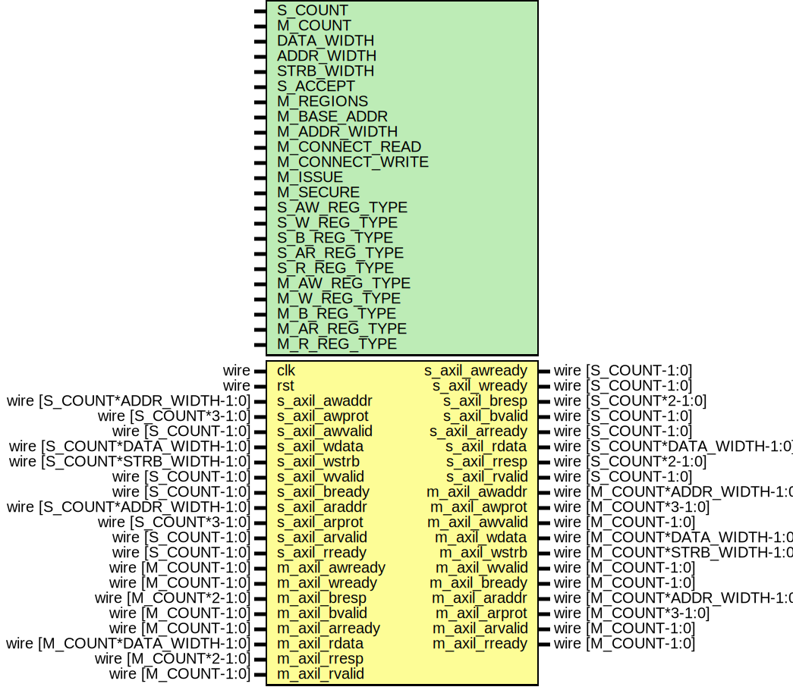

# Entity: axil_crossbar

- **File**: axil_crossbar.v
## Diagram

## Description

 Language: Verilog 2001

## Generics

| Generic name    | Type | Value     | Description                                                                                                                                                                  |
| --------------- | ---- | --------- | ---------------------------------------------------------------------------------------------------------------------------------------------------------------------------- |
| S_COUNT         |      | 4         |  Number of AXI inputs (slave interfaces)                                                                                                                                     |
| M_COUNT         |      | 4         |  Number of AXI outputs (master interfaces)                                                                                                                                   |
| DATA_WIDTH      |      | 32        |  Width of data bus in bits                                                                                                                                                   |
| ADDR_WIDTH      |      | 32        |  Width of address bus in bits                                                                                                                                                |
| STRB_WIDTH      |      | undefined |  Width of wstrb (width of data bus in words)                                                                                                                                 |
| S_ACCEPT        |      | undefined |  Number of concurrent operations for each slave interface  S_COUNT concatenated fields of 32 bits                                                                            |
| M_REGIONS       |      | 1         |  Number of regions per master interface                                                                                                                                      |
| M_BASE_ADDR     |      | 0         |  Master interface base addresses  M_COUNT concatenated fields of M_REGIONS concatenated fields of ADDR_WIDTH bits  set to zero for default addressing based on M_ADDR_WIDTH  |
| M_ADDR_WIDTH    |      | undefined |  Master interface address widths  M_COUNT concatenated fields of M_REGIONS concatenated fields of 32 bits                                                                    |
| M_CONNECT_READ  |      | undefined |  Read connections between interfaces  M_COUNT concatenated fields of S_COUNT bits                                                                                            |
| M_CONNECT_WRITE |      | undefined |  Write connections between interfaces  M_COUNT concatenated fields of S_COUNT bits                                                                                           |
| M_ISSUE         |      | undefined |  Number of concurrent operations for each master interface  M_COUNT concatenated fields of 32 bits                                                                           |
| M_SECURE        |      | undefined |  Secure master (fail operations based on awprot/arprot)  M_COUNT bits                                                                                                        |
| S_AW_REG_TYPE   |      | undefined |  Slave interface AW channel register type (input)  0 to bypass, 1 for simple buffer, 2 for skid buffer                                                                       |
| S_W_REG_TYPE    |      | undefined |  Slave interface W channel register type (input)  0 to bypass, 1 for simple buffer, 2 for skid buffer                                                                        |
| S_B_REG_TYPE    |      | undefined |  Slave interface B channel register type (output)  0 to bypass, 1 for simple buffer, 2 for skid buffer                                                                       |
| S_AR_REG_TYPE   |      | undefined |  Slave interface AR channel register type (input)  0 to bypass, 1 for simple buffer, 2 for skid buffer                                                                       |
| S_R_REG_TYPE    |      | undefined |  Slave interface R channel register type (output)  0 to bypass, 1 for simple buffer, 2 for skid buffer                                                                       |
| M_AW_REG_TYPE   |      | undefined |  Master interface AW channel register type (output)  0 to bypass, 1 for simple buffer, 2 for skid buffer                                                                     |
| M_W_REG_TYPE    |      | undefined |  Master interface W channel register type (output)  0 to bypass, 1 for simple buffer, 2 for skid buffer                                                                      |
| M_B_REG_TYPE    |      | undefined |  Master interface B channel register type (input)  0 to bypass, 1 for simple buffer, 2 for skid buffer                                                                       |
| M_AR_REG_TYPE   |      | undefined |  Master interface AR channel register type (output)  0 to bypass, 1 for simple buffer, 2 for skid buffer                                                                     |
| M_R_REG_TYPE    |      | undefined |  Master interface R channel register type (input)  0 to bypass, 1 for simple buffer, 2 for skid buffer                                                                       |
## Ports

| Port name      | Direction | Type                          | Description                                |
| -------------- | --------- | ----------------------------- | ------------------------------------------ |
| clk            | input     | wire                          |                                            |
| rst            | input     | wire                          |                                            |
| s_axil_awaddr  | input     | wire [S_COUNT*ADDR_WIDTH-1:0] |      * AXI lite slave interfaces      */   |
| s_axil_awprot  | input     | wire [S_COUNT*3-1:0]          |                                            |
| s_axil_awvalid | input     | wire [S_COUNT-1:0]            |                                            |
| s_axil_awready | output    | wire [S_COUNT-1:0]            |                                            |
| s_axil_wdata   | input     | wire [S_COUNT*DATA_WIDTH-1:0] |                                            |
| s_axil_wstrb   | input     | wire [S_COUNT*STRB_WIDTH-1:0] |                                            |
| s_axil_wvalid  | input     | wire [S_COUNT-1:0]            |                                            |
| s_axil_wready  | output    | wire [S_COUNT-1:0]            |                                            |
| s_axil_bresp   | output    | wire [S_COUNT*2-1:0]          |                                            |
| s_axil_bvalid  | output    | wire [S_COUNT-1:0]            |                                            |
| s_axil_bready  | input     | wire [S_COUNT-1:0]            |                                            |
| s_axil_araddr  | input     | wire [S_COUNT*ADDR_WIDTH-1:0] |                                            |
| s_axil_arprot  | input     | wire [S_COUNT*3-1:0]          |                                            |
| s_axil_arvalid | input     | wire [S_COUNT-1:0]            |                                            |
| s_axil_arready | output    | wire [S_COUNT-1:0]            |                                            |
| s_axil_rdata   | output    | wire [S_COUNT*DATA_WIDTH-1:0] |                                            |
| s_axil_rresp   | output    | wire [S_COUNT*2-1:0]          |                                            |
| s_axil_rvalid  | output    | wire [S_COUNT-1:0]            |                                            |
| s_axil_rready  | input     | wire [S_COUNT-1:0]            |                                            |
| m_axil_awaddr  | output    | wire [M_COUNT*ADDR_WIDTH-1:0] |      * AXI lite master interfaces      */  |
| m_axil_awprot  | output    | wire [M_COUNT*3-1:0]          |                                            |
| m_axil_awvalid | output    | wire [M_COUNT-1:0]            |                                            |
| m_axil_awready | input     | wire [M_COUNT-1:0]            |                                            |
| m_axil_wdata   | output    | wire [M_COUNT*DATA_WIDTH-1:0] |                                            |
| m_axil_wstrb   | output    | wire [M_COUNT*STRB_WIDTH-1:0] |                                            |
| m_axil_wvalid  | output    | wire [M_COUNT-1:0]            |                                            |
| m_axil_wready  | input     | wire [M_COUNT-1:0]            |                                            |
| m_axil_bresp   | input     | wire [M_COUNT*2-1:0]          |                                            |
| m_axil_bvalid  | input     | wire [M_COUNT-1:0]            |                                            |
| m_axil_bready  | output    | wire [M_COUNT-1:0]            |                                            |
| m_axil_araddr  | output    | wire [M_COUNT*ADDR_WIDTH-1:0] |                                            |
| m_axil_arprot  | output    | wire [M_COUNT*3-1:0]          |                                            |
| m_axil_arvalid | output    | wire [M_COUNT-1:0]            |                                            |
| m_axil_arready | input     | wire [M_COUNT-1:0]            |                                            |
| m_axil_rdata   | input     | wire [M_COUNT*DATA_WIDTH-1:0] |                                            |
| m_axil_rresp   | input     | wire [M_COUNT*2-1:0]          |                                            |
| m_axil_rvalid  | input     | wire [M_COUNT-1:0]            |                                            |
| m_axil_rready  | output    | wire [M_COUNT-1:0]            |                                            |
## Instantiations

- axil_crossbar_wr_inst: axil_crossbar_wr
- axil_crossbar_rd_inst: axil_crossbar_rd
