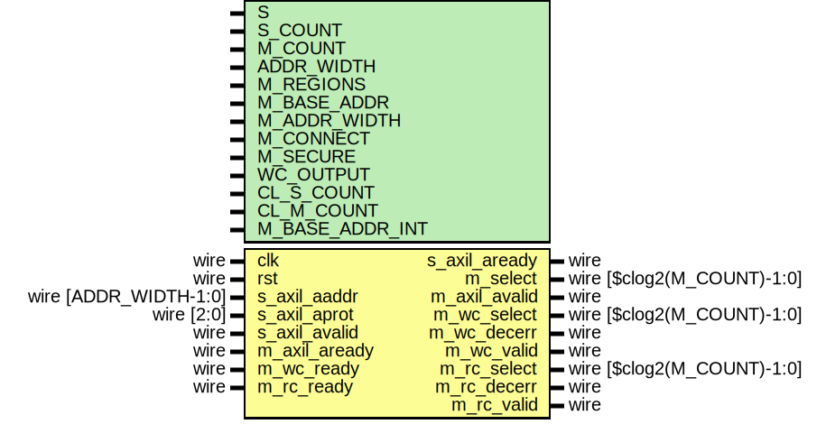

# Entity: axil_crossbar_addr

- **File**: axil_crossbar_addr.v
## Diagram

## Description

 Language: Verilog 2001

## Generics

| Generic name    | Type | Value                                        | Description                                                                                                                                                                  |
| --------------- | ---- | -------------------------------------------- | ---------------------------------------------------------------------------------------------------------------------------------------------------------------------------- |
| S               |      | 0                                            |  Slave interface index                                                                                                                                                       |
| S_COUNT         |      | 4                                            |  Number of AXI inputs (slave interfaces)                                                                                                                                     |
| M_COUNT         |      | 4                                            |  Number of AXI outputs (master interfaces)                                                                                                                                   |
| ADDR_WIDTH      |      | 32                                           |  Width of address bus in bits                                                                                                                                                |
| M_REGIONS       |      | 1                                            |  Number of regions per master interface                                                                                                                                      |
| M_BASE_ADDR     |      | 0                                            |  Master interface base addresses  M_COUNT concatenated fields of M_REGIONS concatenated fields of ADDR_WIDTH bits  set to zero for default addressing based on M_ADDR_WIDTH  |
| M_ADDR_WIDTH    |      | undefined                                    |  Master interface address widths  M_COUNT concatenated fields of M_REGIONS concatenated fields of 32 bits                                                                    |
| M_CONNECT       |      | undefined                                    |  Connections between interfaces  M_COUNT concatenated fields of S_COUNT bits                                                                                                 |
| M_SECURE        |      | undefined                                    |  Secure master (fail operations based on awprot/arprot)  M_COUNT bits                                                                                                        |
| WC_OUTPUT       |      | 0                                            |  Enable write command output                                                                                                                                                 |
| CL_S_COUNT      |      | $clog2(S_COUNT)                              |                                                                                                                                                                              |
| CL_M_COUNT      |      | $clog2(M_COUNT)                              |                                                                                                                                                                              |
| M_BASE_ADDR_INT |      | M_BASE_ADDR ? M_BASE_ADDR : calcBaseAddrs(0) |                                                                                                                                                                              |
## Ports

| Port name     | Direction | Type                       | Description                          |
| ------------- | --------- | -------------------------- | ------------------------------------ |
| clk           | input     | wire                       |                                      |
| rst           | input     | wire                       |                                      |
| s_axil_aaddr  | input     | wire [ADDR_WIDTH-1:0]      |      * Address input      */         |
| s_axil_aprot  | input     | wire [2:0]                 |                                      |
| s_axil_avalid | input     | wire                       |                                      |
| s_axil_aready | output    | wire                       |                                      |
| m_select      | output    | wire [$clog2(M_COUNT)-1:0] |      * Address output      */        |
| m_axil_avalid | output    | wire                       |                                      |
| m_axil_aready | input     | wire                       |                                      |
| m_wc_select   | output    | wire [$clog2(M_COUNT)-1:0] |      * Write command output      */  |
| m_wc_decerr   | output    | wire                       |                                      |
| m_wc_valid    | output    | wire                       |                                      |
| m_wc_ready    | input     | wire                       |                                      |
| m_rc_select   | output    | wire [$clog2(M_COUNT)-1:0] |      * Reply command output      */  |
| m_rc_decerr   | output    | wire                       |                                      |
| m_rc_valid    | output    | wire                       |                                      |
| m_rc_ready    | input     | wire                       |                                      |
## Signals

| Name               | Type                 | Description |
| ------------------ | -------------------- | ----------- |
| i                  | integer              |             |
| j                  | integer              |             |
| state_reg          | reg [2:0]            |             |
| state_next         | reg [2:0]            |             |
| s_axil_aready_reg  | reg                  |             |
| s_axil_aready_next | reg                  |             |
| m_select_reg       | reg [CL_M_COUNT-1:0] |             |
| m_select_next      | reg [CL_M_COUNT-1:0] |             |
| m_axil_avalid_reg  | reg                  |             |
| m_axil_avalid_next | reg                  |             |
| m_decerr_reg       | reg                  |             |
| m_decerr_next      | reg                  |             |
| m_wc_valid_reg     | reg                  |             |
| m_wc_valid_next    | reg                  |             |
| m_rc_valid_reg     | reg                  |             |
| m_rc_valid_next    | reg                  |             |
| match              | reg                  |             |
## Constants

| Name         | Type  | Value | Description |
| ------------ | ----- | ----- | ----------- |
| STATE_IDLE   | [2:0] | 3'd0  |             |
| STATE_DECODE | [2:0] | 3'd1  |             |
## Functions
- calcBaseAddrs (input [31:0]) return ([M_COUNT*M_REGIONS*ADDR_WIDTH-1:0])
 **Description**
 default address computation

## Processes
- unnamed: ( @* )
  - **Type:** always
- unnamed: ( @(posedge clk) )
  - **Type:** always
