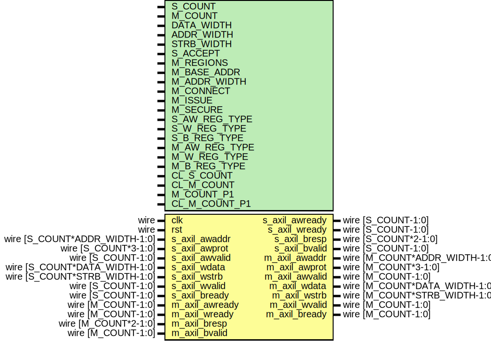

# Entity: axil_crossbar_wr

- **File**: axil_crossbar_wr.v
## Diagram

## Description

 Language: Verilog 2001

## Generics

| Generic name  | Type | Value              | Description                                                                                                                                                                  |
| ------------- | ---- | ------------------ | ---------------------------------------------------------------------------------------------------------------------------------------------------------------------------- |
| S_COUNT       |      | 4                  |  Number of AXI inputs (slave interfaces)                                                                                                                                     |
| M_COUNT       |      | 4                  |  Number of AXI outputs (master interfaces)                                                                                                                                   |
| DATA_WIDTH    |      | 32                 |  Width of data bus in bits                                                                                                                                                   |
| ADDR_WIDTH    |      | 32                 |  Width of address bus in bits                                                                                                                                                |
| STRB_WIDTH    |      | undefined          |  Width of wstrb (width of data bus in words)                                                                                                                                 |
| S_ACCEPT      |      | undefined          |  Number of concurrent operations for each slave interface  S_COUNT concatenated fields of 32 bits                                                                            |
| M_REGIONS     |      | 1                  |  Number of regions per master interface                                                                                                                                      |
| M_BASE_ADDR   |      | 0                  |  Master interface base addresses  M_COUNT concatenated fields of M_REGIONS concatenated fields of ADDR_WIDTH bits  set to zero for default addressing based on M_ADDR_WIDTH  |
| M_ADDR_WIDTH  |      | undefined          |  Master interface address widths  M_COUNT concatenated fields of M_REGIONS concatenated fields of 32 bits                                                                    |
| M_CONNECT     |      | undefined          |  Write connections between interfaces  M_COUNT concatenated fields of S_COUNT bits                                                                                           |
| M_ISSUE       |      | undefined          |  Number of concurrent operations for each master interface  M_COUNT concatenated fields of 32 bits                                                                           |
| M_SECURE      |      | undefined          |  Secure master (fail operations based on awprot/arprot)  M_COUNT bits                                                                                                        |
| S_AW_REG_TYPE |      | undefined          |  Slave interface AW channel register type (input)  0 to bypass, 1 for simple buffer, 2 for skid buffer                                                                       |
| S_W_REG_TYPE  |      | undefined          |  Slave interface W channel register type (input)  0 to bypass, 1 for simple buffer, 2 for skid buffer                                                                        |
| S_B_REG_TYPE  |      | undefined          |  Slave interface B channel register type (output)  0 to bypass, 1 for simple buffer, 2 for skid buffer                                                                       |
| M_AW_REG_TYPE |      | undefined          |  Master interface AW channel register type (output)  0 to bypass, 1 for simple buffer, 2 for skid buffer                                                                     |
| M_W_REG_TYPE  |      | undefined          |  Master interface W channel register type (output)  0 to bypass, 1 for simple buffer, 2 for skid buffer                                                                      |
| M_B_REG_TYPE  |      | undefined          |  Master interface B channel register type (input)  0 to bypass, 1 for simple buffer, 2 for skid buffer                                                                       |
| CL_S_COUNT    |      | $clog2(S_COUNT)    |                                                                                                                                                                              |
| CL_M_COUNT    |      | $clog2(M_COUNT)    |                                                                                                                                                                              |
| M_COUNT_P1    |      | M_COUNT+1          |                                                                                                                                                                              |
| CL_M_COUNT_P1 |      | $clog2(M_COUNT_P1) |                                                                                                                                                                              |
## Ports

| Port name      | Direction | Type                          | Description                                |
| -------------- | --------- | ----------------------------- | ------------------------------------------ |
| clk            | input     | wire                          |                                            |
| rst            | input     | wire                          |                                            |
| s_axil_awaddr  | input     | wire [S_COUNT*ADDR_WIDTH-1:0] |      * AXI lite slave interfaces      */   |
| s_axil_awprot  | input     | wire [S_COUNT*3-1:0]          |                                            |
| s_axil_awvalid | input     | wire [S_COUNT-1:0]            |                                            |
| s_axil_awready | output    | wire [S_COUNT-1:0]            |                                            |
| s_axil_wdata   | input     | wire [S_COUNT*DATA_WIDTH-1:0] |                                            |
| s_axil_wstrb   | input     | wire [S_COUNT*STRB_WIDTH-1:0] |                                            |
| s_axil_wvalid  | input     | wire [S_COUNT-1:0]            |                                            |
| s_axil_wready  | output    | wire [S_COUNT-1:0]            |                                            |
| s_axil_bresp   | output    | wire [S_COUNT*2-1:0]          |                                            |
| s_axil_bvalid  | output    | wire [S_COUNT-1:0]            |                                            |
| s_axil_bready  | input     | wire [S_COUNT-1:0]            |                                            |
| m_axil_awaddr  | output    | wire [M_COUNT*ADDR_WIDTH-1:0] |      * AXI lite master interfaces      */  |
| m_axil_awprot  | output    | wire [M_COUNT*3-1:0]          |                                            |
| m_axil_awvalid | output    | wire [M_COUNT-1:0]            |                                            |
| m_axil_awready | input     | wire [M_COUNT-1:0]            |                                            |
| m_axil_wdata   | output    | wire [M_COUNT*DATA_WIDTH-1:0] |                                            |
| m_axil_wstrb   | output    | wire [M_COUNT*STRB_WIDTH-1:0] |                                            |
| m_axil_wvalid  | output    | wire [M_COUNT-1:0]            |                                            |
| m_axil_wready  | input     | wire [M_COUNT-1:0]            |                                            |
| m_axil_bresp   | input     | wire [M_COUNT*2-1:0]          |                                            |
| m_axil_bvalid  | input     | wire [M_COUNT-1:0]            |                                            |
| m_axil_bready  | output    | wire [M_COUNT-1:0]            |                                            |
## Signals

| Name               | Type                          | Description |
| ------------------ | ----------------------------- | ----------- |
| i                  | integer                       |             |
| int_s_axil_awaddr  | wire [S_COUNT*ADDR_WIDTH-1:0] |             |
| int_s_axil_awprot  | wire [S_COUNT*3-1:0]          |             |
| int_s_axil_awvalid | wire [S_COUNT-1:0]            |             |
| int_s_axil_awready | wire [S_COUNT-1:0]            |             |
| int_axil_awvalid   | wire [S_COUNT*M_COUNT-1:0]    |             |
| int_axil_awready   | wire [M_COUNT*S_COUNT-1:0]    |             |
| int_s_axil_wdata   | wire [S_COUNT*DATA_WIDTH-1:0] |             |
| int_s_axil_wstrb   | wire [S_COUNT*STRB_WIDTH-1:0] |             |
| int_s_axil_wvalid  | wire [S_COUNT-1:0]            |             |
| int_s_axil_wready  | wire [S_COUNT-1:0]            |             |
| int_axil_wvalid    | wire [S_COUNT*M_COUNT-1:0]    |             |
| int_axil_wready    | wire [M_COUNT*S_COUNT-1:0]    |             |
| int_m_axil_bresp   | wire [M_COUNT*2-1:0]          |             |
| int_m_axil_bvalid  | wire [M_COUNT-1:0]            |             |
| int_m_axil_bready  | wire [M_COUNT-1:0]            |             |
| int_axil_bvalid    | wire [M_COUNT*S_COUNT-1:0]    |             |
| int_axil_bready    | wire [S_COUNT*M_COUNT-1:0]    |             |
