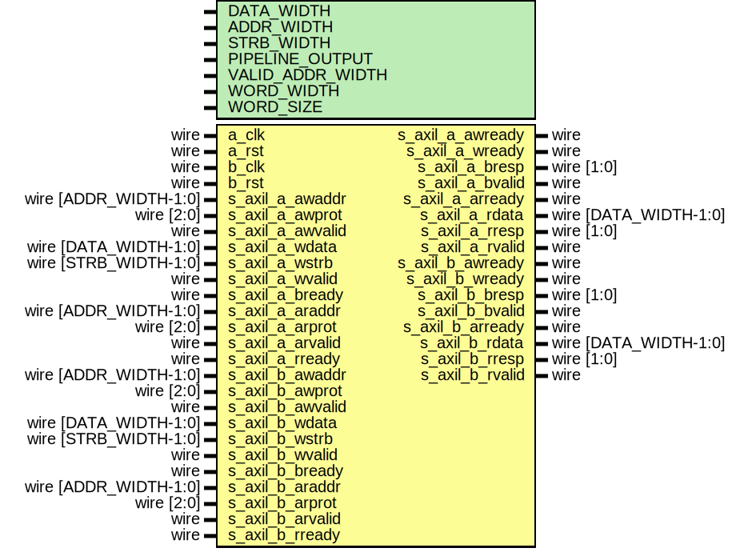

# Entity: axil_dp_ram

## Diagram

## Description

Language: Verilog 2001
 
## Generics

| Generic name     | Type | Value                           | Description                                  |
| ---------------- | ---- | ------------------------------- | -------------------------------------------- |
| DATA_WIDTH       |      | 32                              | Width of data bus in bits                    |
| ADDR_WIDTH       |      | 16                              | Width of address bus in bits                 |
| STRB_WIDTH       |      | undefined                       | Width of wstrb (width of data bus in words)  |
| PIPELINE_OUTPUT  |      | 0                               | Extra pipeline register on output            |
| VALID_ADDR_WIDTH |      | ADDR_WIDTH - $clog2(STRB_WIDTH) |                                              |
| WORD_WIDTH       |      | STRB_WIDTH                      |                                              |
| WORD_SIZE        |      | DATA_WIDTH/WORD_WIDTH           |                                              |
## Ports

| Port name        | Direction | Type                  | Description |
| ---------------- | --------- | --------------------- | ----------- |
| a_clk            | input     | wire                  |             |
| a_rst            | input     | wire                  |             |
| b_clk            | input     | wire                  |             |
| b_rst            | input     | wire                  |             |
| s_axil_a_awaddr  | input     | wire [ADDR_WIDTH-1:0] |             |
| s_axil_a_awprot  | input     | wire [2:0]            |             |
| s_axil_a_awvalid | input     | wire                  |             |
| s_axil_a_awready | output    | wire                  |             |
| s_axil_a_wdata   | input     | wire [DATA_WIDTH-1:0] |             |
| s_axil_a_wstrb   | input     | wire [STRB_WIDTH-1:0] |             |
| s_axil_a_wvalid  | input     | wire                  |             |
| s_axil_a_wready  | output    | wire                  |             |
| s_axil_a_bresp   | output    | wire [1:0]            |             |
| s_axil_a_bvalid  | output    | wire                  |             |
| s_axil_a_bready  | input     | wire                  |             |
| s_axil_a_araddr  | input     | wire [ADDR_WIDTH-1:0] |             |
| s_axil_a_arprot  | input     | wire [2:0]            |             |
| s_axil_a_arvalid | input     | wire                  |             |
| s_axil_a_arready | output    | wire                  |             |
| s_axil_a_rdata   | output    | wire [DATA_WIDTH-1:0] |             |
| s_axil_a_rresp   | output    | wire [1:0]            |             |
| s_axil_a_rvalid  | output    | wire                  |             |
| s_axil_a_rready  | input     | wire                  |             |
| s_axil_b_awaddr  | input     | wire [ADDR_WIDTH-1:0] |             |
| s_axil_b_awprot  | input     | wire [2:0]            |             |
| s_axil_b_awvalid | input     | wire                  |             |
| s_axil_b_awready | output    | wire                  |             |
| s_axil_b_wdata   | input     | wire [DATA_WIDTH-1:0] |             |
| s_axil_b_wstrb   | input     | wire [STRB_WIDTH-1:0] |             |
| s_axil_b_wvalid  | input     | wire                  |             |
| s_axil_b_wready  | output    | wire                  |             |
| s_axil_b_bresp   | output    | wire [1:0]            |             |
| s_axil_b_bvalid  | output    | wire                  |             |
| s_axil_b_bready  | input     | wire                  |             |
| s_axil_b_araddr  | input     | wire [ADDR_WIDTH-1:0] |             |
| s_axil_b_arprot  | input     | wire [2:0]            |             |
| s_axil_b_arvalid | input     | wire                  |             |
| s_axil_b_arready | output    | wire                  |             |
| s_axil_b_rdata   | output    | wire [DATA_WIDTH-1:0] |             |
| s_axil_b_rresp   | output    | wire [1:0]            |             |
| s_axil_b_rvalid  | output    | wire                  |             |
| s_axil_b_rready  | input     | wire                  |             |
## Signals

| Name                     | Type                        | Description              |
| ------------------------ | --------------------------- | ------------------------ |
| read_eligible_a          | reg                         |                          |
| write_eligible_a         | reg                         |                          |
| read_eligible_b          | reg                         |                          |
| write_eligible_b         | reg                         |                          |
| mem_wr_en_a              | reg                         |                          |
| mem_rd_en_a              | reg                         |                          |
| mem_wr_en_b              | reg                         |                          |
| mem_rd_en_b              | reg                         |                          |
| last_read_a_reg          | reg                         |                          |
| last_read_a_next         | reg                         |                          |
| last_read_b_reg          | reg                         |                          |
| last_read_b_next         | reg                         |                          |
| s_axil_a_awready_reg     | reg                         |                          |
| s_axil_a_awready_next    | reg                         |                          |
| s_axil_a_wready_reg      | reg                         |                          |
| s_axil_a_wready_next     | reg                         |                          |
| s_axil_a_bvalid_reg      | reg                         |                          |
| s_axil_a_bvalid_next     | reg                         |                          |
| s_axil_a_arready_reg     | reg                         |                          |
| s_axil_a_arready_next    | reg                         |                          |
| s_axil_a_rdata_reg       | reg [DATA_WIDTH-1:0]        |                          |
| s_axil_a_rdata_next      | reg [DATA_WIDTH-1:0]        |                          |
| s_axil_a_rvalid_reg      | reg                         |                          |
| s_axil_a_rvalid_next     | reg                         |                          |
| s_axil_a_rdata_pipe_reg  | reg [DATA_WIDTH-1:0]        |                          |
| s_axil_a_rvalid_pipe_reg | reg                         |                          |
| s_axil_b_awready_reg     | reg                         |                          |
| s_axil_b_awready_next    | reg                         |                          |
| s_axil_b_wready_reg      | reg                         |                          |
| s_axil_b_wready_next     | reg                         |                          |
| s_axil_b_bvalid_reg      | reg                         |                          |
| s_axil_b_bvalid_next     | reg                         |                          |
| s_axil_b_arready_reg     | reg                         |                          |
| s_axil_b_arready_next    | reg                         |                          |
| s_axil_b_rdata_reg       | reg [DATA_WIDTH-1:0]        |                          |
| s_axil_b_rdata_next      | reg [DATA_WIDTH-1:0]        |                          |
| s_axil_b_rvalid_reg      | reg                         |                          |
| s_axil_b_rvalid_next     | reg                         |                          |
| s_axil_b_rdata_pipe_reg  | reg [DATA_WIDTH-1:0]        |                          |
| s_axil_b_rvalid_pipe_reg | reg                         |                          |
| mem                      | reg [DATA_WIDTH-1:0]        | (* RAM_STYLE="BLOCK" *)  |
| s_axil_a_awaddr_valid    | wire [VALID_ADDR_WIDTH-1:0] |                          |
| s_axil_a_araddr_valid    | wire [VALID_ADDR_WIDTH-1:0] |                          |
| s_axil_b_awaddr_valid    | wire [VALID_ADDR_WIDTH-1:0] |                          |
| s_axil_b_araddr_valid    | wire [VALID_ADDR_WIDTH-1:0] |                          |
| i                        | integer                     |                          |
| j                        | integer                     |                          |
## Processes
- unnamed: ( @* )
- unnamed: ( @(posedge a_clk) )
- unnamed: ( @* )
- unnamed: ( @(posedge b_clk) )
