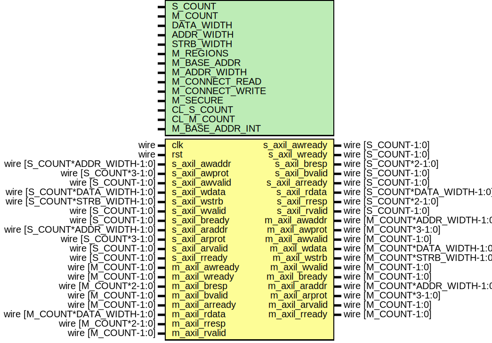

# Entity: axil_interconnect

- **File**: axil_interconnect.v
## Diagram

## Description

Language: Verilog 2001
 
## Generics

| Generic name    | Type | Value                                        | Description                                                                                                                                                               |
| --------------- | ---- | -------------------------------------------- | ------------------------------------------------------------------------------------------------------------------------------------------------------------------------- |
| S_COUNT         |      | 4                                            | Number of AXI inputs (slave interfaces)                                                                                                                                   |
| M_COUNT         |      | 4                                            | Number of AXI outputs (master interfaces)                                                                                                                                 |
| DATA_WIDTH      |      | 32                                           | Width of data bus in bits                                                                                                                                                 |
| ADDR_WIDTH      |      | 32                                           | Width of address bus in bits                                                                                                                                              |
| STRB_WIDTH      |      | undefined                                    | Width of wstrb (width of data bus in words)                                                                                                                               |
| M_REGIONS       |      | 1                                            | Number of regions per master interface                                                                                                                                    |
| M_BASE_ADDR     |      | 0                                            | Master interface base addresses M_COUNT concatenated fields of M_REGIONS concatenated fields of ADDR_WIDTH bits set to zero for default addressing based on M_ADDR_WIDTH  |
| M_ADDR_WIDTH    |      | undefined                                    | Master interface address widths M_COUNT concatenated fields of M_REGIONS concatenated fields of 32 bits                                                                   |
| M_CONNECT_READ  |      | undefined                                    | Read connections between interfaces M_COUNT concatenated fields of S_COUNT bits                                                                                           |
| M_CONNECT_WRITE |      | undefined                                    | Write connections between interfaces M_COUNT concatenated fields of S_COUNT bits                                                                                          |
| M_SECURE        |      | undefined                                    | Secure master (fail operations based on awprot/arprot) M_COUNT bits                                                                                                       |
| CL_S_COUNT      |      | $clog2(S_COUNT)                              |                                                                                                                                                                           |
| CL_M_COUNT      |      | $clog2(M_COUNT)                              |                                                                                                                                                                           |
| M_BASE_ADDR_INT |      | M_BASE_ADDR ? M_BASE_ADDR : calcBaseAddrs(0) |                                                                                                                                                                           |
## Ports

| Port name      | Direction | Type                          | Description |
| -------------- | --------- | ----------------------------- | ----------- |
| clk            | input     | wire                          |             |
| rst            | input     | wire                          |             |
| s_axil_awaddr  | input     | wire [S_COUNT*ADDR_WIDTH-1:0] |             |
| s_axil_awprot  | input     | wire [S_COUNT*3-1:0]          |             |
| s_axil_awvalid | input     | wire [S_COUNT-1:0]            |             |
| s_axil_awready | output    | wire [S_COUNT-1:0]            |             |
| s_axil_wdata   | input     | wire [S_COUNT*DATA_WIDTH-1:0] |             |
| s_axil_wstrb   | input     | wire [S_COUNT*STRB_WIDTH-1:0] |             |
| s_axil_wvalid  | input     | wire [S_COUNT-1:0]            |             |
| s_axil_wready  | output    | wire [S_COUNT-1:0]            |             |
| s_axil_bresp   | output    | wire [S_COUNT*2-1:0]          |             |
| s_axil_bvalid  | output    | wire [S_COUNT-1:0]            |             |
| s_axil_bready  | input     | wire [S_COUNT-1:0]            |             |
| s_axil_araddr  | input     | wire [S_COUNT*ADDR_WIDTH-1:0] |             |
| s_axil_arprot  | input     | wire [S_COUNT*3-1:0]          |             |
| s_axil_arvalid | input     | wire [S_COUNT-1:0]            |             |
| s_axil_arready | output    | wire [S_COUNT-1:0]            |             |
| s_axil_rdata   | output    | wire [S_COUNT*DATA_WIDTH-1:0] |             |
| s_axil_rresp   | output    | wire [S_COUNT*2-1:0]          |             |
| s_axil_rvalid  | output    | wire [S_COUNT-1:0]            |             |
| s_axil_rready  | input     | wire [S_COUNT-1:0]            |             |
| m_axil_awaddr  | output    | wire [M_COUNT*ADDR_WIDTH-1:0] |             |
| m_axil_awprot  | output    | wire [M_COUNT*3-1:0]          |             |
| m_axil_awvalid | output    | wire [M_COUNT-1:0]            |             |
| m_axil_awready | input     | wire [M_COUNT-1:0]            |             |
| m_axil_wdata   | output    | wire [M_COUNT*DATA_WIDTH-1:0] |             |
| m_axil_wstrb   | output    | wire [M_COUNT*STRB_WIDTH-1:0] |             |
| m_axil_wvalid  | output    | wire [M_COUNT-1:0]            |             |
| m_axil_wready  | input     | wire [M_COUNT-1:0]            |             |
| m_axil_bresp   | input     | wire [M_COUNT*2-1:0]          |             |
| m_axil_bvalid  | input     | wire [M_COUNT-1:0]            |             |
| m_axil_bready  | output    | wire [M_COUNT-1:0]            |             |
| m_axil_araddr  | output    | wire [M_COUNT*ADDR_WIDTH-1:0] |             |
| m_axil_arprot  | output    | wire [M_COUNT*3-1:0]          |             |
| m_axil_arvalid | output    | wire [M_COUNT-1:0]            |             |
| m_axil_arready | input     | wire [M_COUNT-1:0]            |             |
| m_axil_rdata   | input     | wire [M_COUNT*DATA_WIDTH-1:0] |             |
| m_axil_rresp   | input     | wire [M_COUNT*2-1:0]          |             |
| m_axil_rvalid  | input     | wire [M_COUNT-1:0]            |             |
| m_axil_rready  | output    | wire [M_COUNT-1:0]            |             |
## Signals

| Name                   | Type                                         | Description       |
| ---------------------- | -------------------------------------------- | ----------------- |
| i                      | integer                                      |                   |
| j                      | integer                                      |                   |
| state_reg              | reg [2:0]                                    |                   |
| state_next             | reg [2:0]                                    |                   |
| match                  | reg                                          |                   |
| m_select_reg           | reg [CL_M_COUNT-1:0]                         |                   |
| m_select_next          | reg [CL_M_COUNT-1:0]                         |                   |
| axil_addr_reg          | reg [ADDR_WIDTH-1:0]                         |                   |
| axil_addr_next         | reg [ADDR_WIDTH-1:0]                         |                   |
| axil_addr_valid_reg    | reg                                          |                   |
| axil_addr_valid_next   | reg                                          |                   |
| axil_prot_reg          | reg [2:0]                                    |                   |
| axil_prot_next         | reg [2:0]                                    |                   |
| axil_data_reg          | reg [DATA_WIDTH-1:0]                         |                   |
| axil_data_next         | reg [DATA_WIDTH-1:0]                         |                   |
| axil_wstrb_reg         | reg [STRB_WIDTH-1:0]                         |                   |
| axil_wstrb_next        | reg [STRB_WIDTH-1:0]                         |                   |
| axil_resp_reg          | reg [1:0]                                    |                   |
| axil_resp_next         | reg [1:0]                                    |                   |
| s_axil_awready_reg     | reg [S_COUNT-1:0]                            |                   |
| s_axil_awready_next    | reg [S_COUNT-1:0]                            |                   |
| s_axil_wready_reg      | reg [S_COUNT-1:0]                            |                   |
| s_axil_wready_next     | reg [S_COUNT-1:0]                            |                   |
| s_axil_bvalid_reg      | reg [S_COUNT-1:0]                            |                   |
| s_axil_bvalid_next     | reg [S_COUNT-1:0]                            |                   |
| s_axil_arready_reg     | reg [S_COUNT-1:0]                            |                   |
| s_axil_arready_next    | reg [S_COUNT-1:0]                            |                   |
| s_axil_rvalid_reg      | reg [S_COUNT-1:0]                            |                   |
| s_axil_rvalid_next     | reg [S_COUNT-1:0]                            |                   |
| m_axil_awvalid_reg     | reg [M_COUNT-1:0]                            |                   |
| m_axil_awvalid_next    | reg [M_COUNT-1:0]                            |                   |
| m_axil_wvalid_reg      | reg [M_COUNT-1:0]                            |                   |
| m_axil_wvalid_next     | reg [M_COUNT-1:0]                            |                   |
| m_axil_bready_reg      | reg [M_COUNT-1:0]                            |                   |
| m_axil_bready_next     | reg [M_COUNT-1:0]                            |                   |
| m_axil_arvalid_reg     | reg [M_COUNT-1:0]                            |                   |
| m_axil_arvalid_next    | reg [M_COUNT-1:0]                            |                   |
| m_axil_rready_reg      | reg [M_COUNT-1:0]                            |                   |
| m_axil_rready_next     | reg [M_COUNT-1:0]                            |                   |
| s_select               | wire [(CL_S_COUNT > 0 ? CL_S_COUNT-1 : 0):0] | slave side mux    |
| current_s_axil_awaddr  | wire [ADDR_WIDTH-1:0]                        |                   |
| current_s_axil_awprot  | wire [2:0]                                   |                   |
| current_s_axil_awvalid | wire                                         |                   |
| current_s_axil_awready | wire                                         |                   |
| current_s_axil_wdata   | wire [DATA_WIDTH-1:0]                        |                   |
| current_s_axil_wstrb   | wire [STRB_WIDTH-1:0]                        |                   |
| current_s_axil_wvalid  | wire                                         |                   |
| current_s_axil_wready  | wire                                         |                   |
| current_s_axil_bresp   | wire [1:0]                                   |                   |
| current_s_axil_bvalid  | wire                                         |                   |
| current_s_axil_bready  | wire                                         |                   |
| current_s_axil_araddr  | wire [ADDR_WIDTH-1:0]                        |                   |
| current_s_axil_arprot  | wire [2:0]                                   |                   |
| current_s_axil_arvalid | wire                                         |                   |
| current_s_axil_arready | wire                                         |                   |
| current_s_axil_rdata   | wire [DATA_WIDTH-1:0]                        |                   |
| current_s_axil_rresp   | wire [1:0]                                   |                   |
| current_s_axil_rvalid  | wire                                         |                   |
| current_s_axil_rready  | wire                                         |                   |
| current_m_axil_awaddr  | wire [ADDR_WIDTH-1:0]                        | master side mux   |
| current_m_axil_awprot  | wire [2:0]                                   |                   |
| current_m_axil_awvalid | wire                                         |                   |
| current_m_axil_awready | wire                                         |                   |
| current_m_axil_wdata   | wire [DATA_WIDTH-1:0]                        |                   |
| current_m_axil_wstrb   | wire [STRB_WIDTH-1:0]                        |                   |
| current_m_axil_wvalid  | wire                                         |                   |
| current_m_axil_wready  | wire                                         |                   |
| current_m_axil_bresp   | wire [1:0]                                   |                   |
| current_m_axil_bvalid  | wire                                         |                   |
| current_m_axil_bready  | wire                                         |                   |
| current_m_axil_araddr  | wire [ADDR_WIDTH-1:0]                        |                   |
| current_m_axil_arprot  | wire [2:0]                                   |                   |
| current_m_axil_arvalid | wire                                         |                   |
| current_m_axil_arready | wire                                         |                   |
| current_m_axil_rdata   | wire [DATA_WIDTH-1:0]                        |                   |
| current_m_axil_rresp   | wire [1:0]                                   |                   |
| current_m_axil_rvalid  | wire                                         |                   |
| current_m_axil_rready  | wire                                         |                   |
| request                | wire [S_COUNT*2-1:0]                         | arbiter instance  |
| acknowledge            | wire [S_COUNT*2-1:0]                         |                   |
| grant                  | wire [S_COUNT*2-1:0]                         |                   |
| grant_valid            | wire                                         |                   |
| grant_encoded          | wire [CL_S_COUNT:0]                          |                   |
| read                   | wire                                         |                   |
## Constants

| Name             | Type  | Value | Description |
| ---------------- | ----- | ----- | ----------- |
| STATE_IDLE       | [2:0] | 3'd0  |             |
| STATE_DECODE     | [2:0] | 3'd1  |             |
| STATE_WRITE      | [2:0] | 3'd2  |             |
| STATE_WRITE_RESP | [2:0] | 3'd3  |             |
| STATE_WRITE_DROP | [2:0] | 3'd4  |             |
| STATE_READ       | [2:0] | 3'd5  |             |
| STATE_WAIT_IDLE  | [2:0] | 3'd6  |             |
## Functions
- calcBaseAddrs (input [31:0]) return ([M_COUNT*M_REGIONS*ADDR_WIDTH-1:0])
**Description**
default address computation

## Processes
- unnamed: ( @* )
- unnamed: ( @(posedge clk) )
## Instantiations

- arb_inst: arbiter
