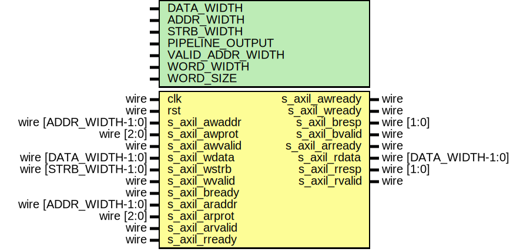

# Entity: axil_ram

- **File**: axil_ram.v
## Diagram

## Description

Language: Verilog 2001
 
## Generics

| Generic name     | Type | Value                           | Description                                  |
| ---------------- | ---- | ------------------------------- | -------------------------------------------- |
| DATA_WIDTH       |      | 32                              | Width of data bus in bits                    |
| ADDR_WIDTH       |      | 16                              | Width of address bus in bits                 |
| STRB_WIDTH       |      | undefined                       | Width of wstrb (width of data bus in words)  |
| PIPELINE_OUTPUT  |      | 0                               | Extra pipeline register on output            |
| VALID_ADDR_WIDTH |      | ADDR_WIDTH - $clog2(STRB_WIDTH) |                                              |
| WORD_WIDTH       |      | STRB_WIDTH                      |                                              |
| WORD_SIZE        |      | DATA_WIDTH/WORD_WIDTH           |                                              |
## Ports

| Port name      | Direction | Type                  | Description |
| -------------- | --------- | --------------------- | ----------- |
| clk            | input     | wire                  |             |
| rst            | input     | wire                  |             |
| s_axil_awaddr  | input     | wire [ADDR_WIDTH-1:0] |             |
| s_axil_awprot  | input     | wire [2:0]            |             |
| s_axil_awvalid | input     | wire                  |             |
| s_axil_awready | output    | wire                  |             |
| s_axil_wdata   | input     | wire [DATA_WIDTH-1:0] |             |
| s_axil_wstrb   | input     | wire [STRB_WIDTH-1:0] |             |
| s_axil_wvalid  | input     | wire                  |             |
| s_axil_wready  | output    | wire                  |             |
| s_axil_bresp   | output    | wire [1:0]            |             |
| s_axil_bvalid  | output    | wire                  |             |
| s_axil_bready  | input     | wire                  |             |
| s_axil_araddr  | input     | wire [ADDR_WIDTH-1:0] |             |
| s_axil_arprot  | input     | wire [2:0]            |             |
| s_axil_arvalid | input     | wire                  |             |
| s_axil_arready | output    | wire                  |             |
| s_axil_rdata   | output    | wire [DATA_WIDTH-1:0] |             |
| s_axil_rresp   | output    | wire [1:0]            |             |
| s_axil_rvalid  | output    | wire                  |             |
| s_axil_rready  | input     | wire                  |             |
## Signals

| Name                   | Type                        | Description              |
| ---------------------- | --------------------------- | ------------------------ |
| mem_wr_en              | reg                         |                          |
| mem_rd_en              | reg                         |                          |
| s_axil_awready_reg     | reg                         |                          |
| s_axil_awready_next    | reg                         |                          |
| s_axil_wready_reg      | reg                         |                          |
| s_axil_wready_next     | reg                         |                          |
| s_axil_bvalid_reg      | reg                         |                          |
| s_axil_bvalid_next     | reg                         |                          |
| s_axil_arready_reg     | reg                         |                          |
| s_axil_arready_next    | reg                         |                          |
| s_axil_rdata_reg       | reg [DATA_WIDTH-1:0]        |                          |
| s_axil_rdata_next      | reg [DATA_WIDTH-1:0]        |                          |
| s_axil_rvalid_reg      | reg                         |                          |
| s_axil_rvalid_next     | reg                         |                          |
| s_axil_rdata_pipe_reg  | reg [DATA_WIDTH-1:0]        |                          |
| s_axil_rvalid_pipe_reg | reg                         |                          |
| mem                    | reg [DATA_WIDTH-1:0]        | (* RAM_STYLE="BLOCK" *)  |
| s_axil_awaddr_valid    | wire [VALID_ADDR_WIDTH-1:0] |                          |
| s_axil_araddr_valid    | wire [VALID_ADDR_WIDTH-1:0] |                          |
| i                      | integer                     |                          |
| j                      | integer                     |                          |
## Processes
- unnamed: ( @* )
- unnamed: ( @(posedge clk) )
- unnamed: ( @* )
- unnamed: ( @(posedge clk) )
