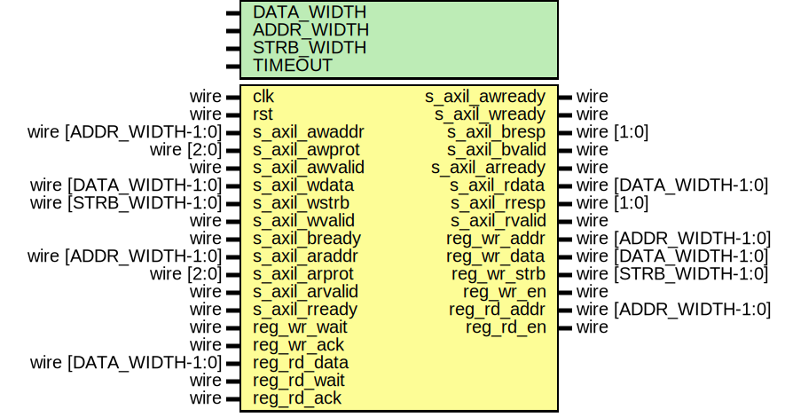

# Entity: axil_reg_if

- **File**: axil_reg_if.v
## Diagram

## Description

 Language: Verilog 2001

## Generics

| Generic name | Type | Value     | Description                                   |
| ------------ | ---- | --------- | --------------------------------------------- |
| DATA_WIDTH   |      | 32        |  Width of data bus in bits                    |
| ADDR_WIDTH   |      | 32        |  Width of address bus in bits                 |
| STRB_WIDTH   |      | undefined |  Width of wstrb (width of data bus in words)  |
| TIMEOUT      |      | 4         |  Timeout delay (cycles)                       |
## Ports

| Port name      | Direction | Type                  | Description                              |
| -------------- | --------- | --------------------- | ---------------------------------------- |
| clk            | input     | wire                  |                                          |
| rst            | input     | wire                  |                                          |
| s_axil_awaddr  | input     | wire [ADDR_WIDTH-1:0] |      * AXI-Lite slave interface      */  |
| s_axil_awprot  | input     | wire [2:0]            |                                          |
| s_axil_awvalid | input     | wire                  |                                          |
| s_axil_awready | output    | wire                  |                                          |
| s_axil_wdata   | input     | wire [DATA_WIDTH-1:0] |                                          |
| s_axil_wstrb   | input     | wire [STRB_WIDTH-1:0] |                                          |
| s_axil_wvalid  | input     | wire                  |                                          |
| s_axil_wready  | output    | wire                  |                                          |
| s_axil_bresp   | output    | wire [1:0]            |                                          |
| s_axil_bvalid  | output    | wire                  |                                          |
| s_axil_bready  | input     | wire                  |                                          |
| s_axil_araddr  | input     | wire [ADDR_WIDTH-1:0] |                                          |
| s_axil_arprot  | input     | wire [2:0]            |                                          |
| s_axil_arvalid | input     | wire                  |                                          |
| s_axil_arready | output    | wire                  |                                          |
| s_axil_rdata   | output    | wire [DATA_WIDTH-1:0] |                                          |
| s_axil_rresp   | output    | wire [1:0]            |                                          |
| s_axil_rvalid  | output    | wire                  |                                          |
| s_axil_rready  | input     | wire                  |                                          |
| reg_wr_addr    | output    | wire [ADDR_WIDTH-1:0] |      * Register interface      */        |
| reg_wr_data    | output    | wire [DATA_WIDTH-1:0] |                                          |
| reg_wr_strb    | output    | wire [STRB_WIDTH-1:0] |                                          |
| reg_wr_en      | output    | wire                  |                                          |
| reg_wr_wait    | input     | wire                  |                                          |
| reg_wr_ack     | input     | wire                  |                                          |
| reg_rd_addr    | output    | wire [ADDR_WIDTH-1:0] |                                          |
| reg_rd_en      | output    | wire                  |                                          |
| reg_rd_data    | input     | wire [DATA_WIDTH-1:0] |                                          |
| reg_rd_wait    | input     | wire                  |                                          |
| reg_rd_ack     | input     | wire                  |                                          |
## Instantiations

- axil_reg_if_wr_inst: axil_reg_if_wr
- axil_reg_if_rd_inst: axil_reg_if_rd
