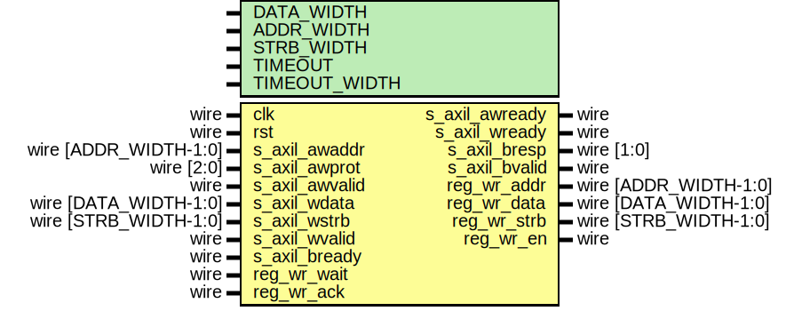

# Entity: axil_reg_if_wr

- **File**: axil_reg_if_wr.v
## Diagram

## Description

 Language: Verilog 2001

## Generics

| Generic name  | Type | Value           | Description                                   |
| ------------- | ---- | --------------- | --------------------------------------------- |
| DATA_WIDTH    |      | 32              |  Width of data bus in bits                    |
| ADDR_WIDTH    |      | 32              |  Width of address bus in bits                 |
| STRB_WIDTH    |      | undefined       |  Width of wstrb (width of data bus in words)  |
| TIMEOUT       |      | 4               |  Timeout delay (cycles)                       |
| TIMEOUT_WIDTH |      | $clog2(TIMEOUT) |                                               |
## Ports

| Port name      | Direction | Type                  | Description                              |
| -------------- | --------- | --------------------- | ---------------------------------------- |
| clk            | input     | wire                  |                                          |
| rst            | input     | wire                  |                                          |
| s_axil_awaddr  | input     | wire [ADDR_WIDTH-1:0] |      * AXI-Lite slave interface      */  |
| s_axil_awprot  | input     | wire [2:0]            |                                          |
| s_axil_awvalid | input     | wire                  |                                          |
| s_axil_awready | output    | wire                  |                                          |
| s_axil_wdata   | input     | wire [DATA_WIDTH-1:0] |                                          |
| s_axil_wstrb   | input     | wire [STRB_WIDTH-1:0] |                                          |
| s_axil_wvalid  | input     | wire                  |                                          |
| s_axil_wready  | output    | wire                  |                                          |
| s_axil_bresp   | output    | wire [1:0]            |                                          |
| s_axil_bvalid  | output    | wire                  |                                          |
| s_axil_bready  | input     | wire                  |                                          |
| reg_wr_addr    | output    | wire [ADDR_WIDTH-1:0] |      * Register interface      */        |
| reg_wr_data    | output    | wire [DATA_WIDTH-1:0] |                                          |
| reg_wr_strb    | output    | wire [STRB_WIDTH-1:0] |                                          |
| reg_wr_en      | output    | wire                  |                                          |
| reg_wr_wait    | input     | wire                  |                                          |
| reg_wr_ack     | input     | wire                  |                                          |
## Signals

| Name                | Type                    | Description |
| ------------------- | ----------------------- | ----------- |
| timeout_count_reg   | reg [TIMEOUT_WIDTH-1:0] |             |
| timeout_count_next  | reg [TIMEOUT_WIDTH-1:0] |             |
| s_axil_awaddr_reg   | reg [ADDR_WIDTH-1:0]    |             |
| s_axil_awaddr_next  | reg [ADDR_WIDTH-1:0]    |             |
| s_axil_awvalid_reg  | reg                     |             |
| s_axil_awvalid_next | reg                     |             |
| s_axil_wdata_reg    | reg [DATA_WIDTH-1:0]    |             |
| s_axil_wdata_next   | reg [DATA_WIDTH-1:0]    |             |
| s_axil_wstrb_reg    | reg [STRB_WIDTH-1:0]    |             |
| s_axil_wstrb_next   | reg [STRB_WIDTH-1:0]    |             |
| s_axil_wvalid_reg   | reg                     |             |
| s_axil_wvalid_next  | reg                     |             |
| s_axil_bvalid_reg   | reg                     |             |
| s_axil_bvalid_next  | reg                     |             |
| reg_wr_en_reg       | reg                     |             |
| reg_wr_en_next      | reg                     |             |
## Processes
- unnamed: ( @* )
  - **Type:** always
- unnamed: ( @(posedge clk) )
  - **Type:** always
