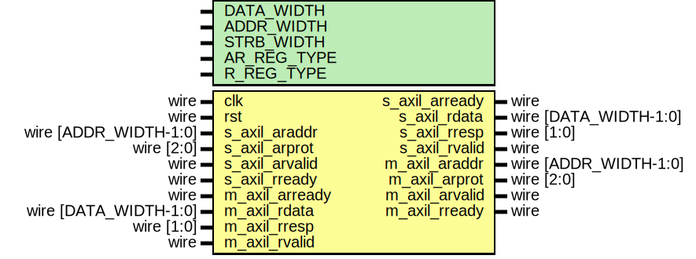

# Entity: axil_register_rd

- **File**: axil_register_rd.v
## Diagram

## Description

Language: Verilog 2001
 
## Generics

| Generic name | Type | Value     | Description                                                |
| ------------ | ---- | --------- | ---------------------------------------------------------- |
| DATA_WIDTH   |      | 32        | Width of data bus in bits                                  |
| ADDR_WIDTH   |      | 32        | Width of address bus in bits                               |
| STRB_WIDTH   |      | undefined | Width of wstrb (width of data bus in words)                |
| AR_REG_TYPE  |      | 1         | AR channel register type 0 to bypass, 1 for simple buffer  |
| R_REG_TYPE   |      | 1         | R channel register type 0 to bypass, 1 for simple buffer   |
## Ports

| Port name      | Direction | Type                  | Description |
| -------------- | --------- | --------------------- | ----------- |
| clk            | input     | wire                  |             |
| rst            | input     | wire                  |             |
| s_axil_araddr  | input     | wire [ADDR_WIDTH-1:0] |             |
| s_axil_arprot  | input     | wire [2:0]            |             |
| s_axil_arvalid | input     | wire                  |             |
| s_axil_arready | output    | wire                  |             |
| s_axil_rdata   | output    | wire [DATA_WIDTH-1:0] |             |
| s_axil_rresp   | output    | wire [1:0]            |             |
| s_axil_rvalid  | output    | wire                  |             |
| s_axil_rready  | input     | wire                  |             |
| m_axil_araddr  | output    | wire [ADDR_WIDTH-1:0] |             |
| m_axil_arprot  | output    | wire [2:0]            |             |
| m_axil_arvalid | output    | wire                  |             |
| m_axil_arready | input     | wire                  |             |
| m_axil_rdata   | input     | wire [DATA_WIDTH-1:0] |             |
| m_axil_rresp   | input     | wire [1:0]            |             |
| m_axil_rvalid  | input     | wire                  |             |
| m_axil_rready  | output    | wire                  |             |
