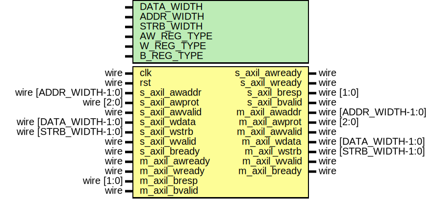

# Entity: axil_register_wr

- **File**: axil_register_wr.v
## Diagram

## Description

 Language: Verilog 2001

## Generics

| Generic name | Type | Value     | Description                                                  |
| ------------ | ---- | --------- | ------------------------------------------------------------ |
| DATA_WIDTH   |      | 32        |  Width of data bus in bits                                   |
| ADDR_WIDTH   |      | 32        |  Width of address bus in bits                                |
| STRB_WIDTH   |      | undefined |  Width of wstrb (width of data bus in words)                 |
| AW_REG_TYPE  |      | 1         |  AW channel register type  0 to bypass, 1 for simple buffer  |
| W_REG_TYPE   |      | 1         |  W channel register type  0 to bypass, 1 for simple buffer   |
| B_REG_TYPE   |      | 1         |  B channel register type  0 to bypass, 1 for simple buffer   |
## Ports

| Port name      | Direction | Type                  | Description                               |
| -------------- | --------- | --------------------- | ----------------------------------------- |
| clk            | input     | wire                  |                                           |
| rst            | input     | wire                  |                                           |
| s_axil_awaddr  | input     | wire [ADDR_WIDTH-1:0] |      * AXI lite slave interface      */   |
| s_axil_awprot  | input     | wire [2:0]            |                                           |
| s_axil_awvalid | input     | wire                  |                                           |
| s_axil_awready | output    | wire                  |                                           |
| s_axil_wdata   | input     | wire [DATA_WIDTH-1:0] |                                           |
| s_axil_wstrb   | input     | wire [STRB_WIDTH-1:0] |                                           |
| s_axil_wvalid  | input     | wire                  |                                           |
| s_axil_wready  | output    | wire                  |                                           |
| s_axil_bresp   | output    | wire [1:0]            |                                           |
| s_axil_bvalid  | output    | wire                  |                                           |
| s_axil_bready  | input     | wire                  |                                           |
| m_axil_awaddr  | output    | wire [ADDR_WIDTH-1:0] |      * AXI lite master interface      */  |
| m_axil_awprot  | output    | wire [2:0]            |                                           |
| m_axil_awvalid | output    | wire                  |                                           |
| m_axil_awready | input     | wire                  |                                           |
| m_axil_wdata   | output    | wire [DATA_WIDTH-1:0] |                                           |
| m_axil_wstrb   | output    | wire [STRB_WIDTH-1:0] |                                           |
| m_axil_wvalid  | output    | wire                  |                                           |
| m_axil_wready  | input     | wire                  |                                           |
| m_axil_bresp   | input     | wire [1:0]            |                                           |
| m_axil_bvalid  | input     | wire                  |                                           |
| m_axil_bready  | output    | wire                  |                                           |
