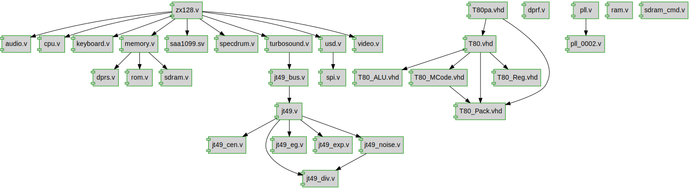

# Project documentation: 

## Designs

- Module: [jt49 ](./doc_internal/jt49.md)
- Module: [jt49_bus ](./doc_internal/jt49_bus.md)
- Module: [jt49_cen ](./doc_internal/jt49_cen.md)
- Module: [jt49_div ](./doc_internal/jt49_div.md)
- Module: [jt49_eg ](./doc_internal/jt49_eg.md)
- Module: [jt49_exp ](./doc_internal/jt49_exp.md)
- Module: [jt49_noise ](./doc_internal/jt49_noise.md)
- Module: [T80 ](./doc_internal/T80.md)
- Module: [T80_ALU ](./doc_internal/T80_ALU.md)
- Module: [T80_MCode ](./doc_internal/T80_MCode.md)
- Package: [T80_Pack ](./doc_internal/T80_Pack.md)
- Module: [T80_Reg ](./doc_internal/T80_Reg.md)
- Module: [T80pa ](./doc_internal/T80pa.md)
- Module: [audio ](./doc_internal/audio.md)
- Module: [cpu ](./doc_internal/cpu.md)
- Module: [dprf ](./doc_internal/dprf.md)
- Module: [dprs ](./doc_internal/dprs.md)
- Module: [keyboard ](./doc_internal/keyboard.md)
- Module: [memory ](./doc_internal/memory.md)
- Module: [pll_0002 ](./doc_internal/pll_0002.md)
- Module: [pll ](./doc_internal/pll.md)
- Module: [ram ](./doc_internal/ram.md)
- Module: [rom ](./doc_internal/rom.md)
- Module: [saa1099 ](./doc_internal/saa1099.md)
- Module: [sdram ](./doc_internal/sdram.md)
- Module: [specdrum ](./doc_internal/specdrum.md)
- Module: [spi ](./doc_internal/spi.md)
- Module: [turbosound ](./doc_internal/turbosound.md)
- Module: [usd ](./doc_internal/usd.md)
- Module: [video ](./doc_internal/video.md)
- Module: [zx128 ](./doc_internal/zx128.md)

