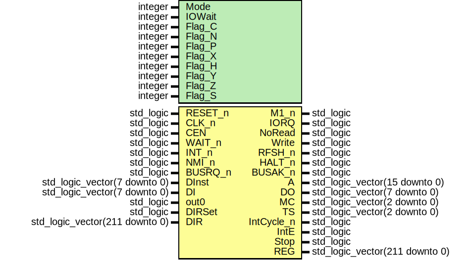

# Entity: T80
## Diagram

## Generics
| Generic name | Type    | Value | Description |
| ------------ | ------- | ----- | ----------- |
| Mode         | integer | 0     |             |
| IOWait       | integer | 0     |             |
| Flag_C       | integer | 0     |             |
| Flag_N       | integer | 1     |             |
| Flag_P       | integer | 2     |             |
| Flag_X       | integer | 3     |             |
| Flag_H       | integer | 4     |             |
| Flag_Y       | integer | 5     |             |
| Flag_Z       | integer | 6     |             |
| Flag_S       | integer | 7     |             |
## Ports
| Port name  | Direction | Type                           | Description |
| ---------- | --------- | ------------------------------ | ----------- |
| RESET_n    | in        | std_logic                      |             |
| CLK_n      | in        | std_logic                      |             |
| CEN        | in        | std_logic                      |             |
| WAIT_n     | in        | std_logic                      |             |
| INT_n      | in        | std_logic                      |             |
| NMI_n      | in        | std_logic                      |             |
| BUSRQ_n    | in        | std_logic                      |             |
| M1_n       | out       | std_logic                      |             |
| IORQ       | out       | std_logic                      |             |
| NoRead     | out       | std_logic                      |             |
| Write      | out       | std_logic                      |             |
| RFSH_n     | out       | std_logic                      |             |
| HALT_n     | out       | std_logic                      |             |
| BUSAK_n    | out       | std_logic                      |             |
| A          | out       | std_logic_vector(15 downto 0)  |             |
| DInst      | in        | std_logic_vector(7 downto 0)   |             |
| DI         | in        | std_logic_vector(7 downto 0)   |             |
| DO         | out       | std_logic_vector(7 downto 0)   |             |
| MC         | out       | std_logic_vector(2 downto 0)   |             |
| TS         | out       | std_logic_vector(2 downto 0)   |             |
| IntCycle_n | out       | std_logic                      |             |
| IntE       | out       | std_logic                      |             |
| Stop       | out       | std_logic                      |             |
| out0       | in        | std_logic                      |             |
| REG        | out       | std_logic_vector(211 downto 0) |             |
| DIRSet     | in        | std_logic                      |             |
| DIR        | in        | std_logic_vector(211 downto 0) |             |
## Signals
| Name            | Type                           | Description |
| --------------- | ------------------------------ | ----------- |
| ACC             | std_logic_vector(7 downto 0)   |             |
|  F              | std_logic_vector(7 downto 0)   |             |
| Ap              | std_logic_vector(7 downto 0)   |             |
|  Fp             | std_logic_vector(7 downto 0)   |             |
| I               | std_logic_vector(7 downto 0)   |             |
| R               | unsigned(7 downto 0)           |             |
| SP              | unsigned(15 downto 0)          |             |
|  PC             | unsigned(15 downto 0)          |             |
| RegDIH          | std_logic_vector(7 downto 0)   |             |
| RegDIL          | std_logic_vector(7 downto 0)   |             |
| RegBusA         | std_logic_vector(15 downto 0)  |             |
| RegBusB         | std_logic_vector(15 downto 0)  |             |
| RegBusC         | std_logic_vector(15 downto 0)  |             |
| RegAddrA_r      | std_logic_vector(2 downto 0)   |             |
| RegAddrA        | std_logic_vector(2 downto 0)   |             |
| RegAddrB_r      | std_logic_vector(2 downto 0)   |             |
| RegAddrB        | std_logic_vector(2 downto 0)   |             |
| RegAddrC        | std_logic_vector(2 downto 0)   |             |
| RegWEH          | std_logic                      |             |
| RegWEL          | std_logic                      |             |
| Alternate       | std_logic                      |             |
| WZ              | std_logic_vector(15 downto 0)  |             |
| IR              | std_logic_vector(7 downto 0)   |             |
| ISet            | std_logic_vector(1 downto 0)   |             |
| RegBusA_r       | std_logic_vector(15 downto 0)  |             |
| ID16            | signed(15 downto 0)            |             |
| Save_Mux        | std_logic_vector(7 downto 0)   |             |
| TState          | unsigned(2 downto 0)           |             |
| MCycle          | std_logic_vector(2 downto 0)   |             |
| IntE_FF1        | std_logic                      |             |
| IntE_FF2        | std_logic                      |             |
| Halt_FF         | std_logic                      |             |
| BusReq_s        | std_logic                      |             |
| BusAck          | std_logic                      |             |
| ClkEn           | std_logic                      |             |
| NMI_s           | std_logic                      |             |
| IStatus         | std_logic_vector(1 downto 0)   |             |
| DI_Reg          | std_logic_vector(7 downto 0)   |             |
| T_Res           | std_logic                      |             |
| XY_State        | std_logic_vector(1 downto 0)   |             |
| Pre_XY_F_M      | std_logic_vector(2 downto 0)   |             |
| NextIs_XY_Fetch | std_logic                      |             |
| XY_Ind          | std_logic                      |             |
| No_BTR          | std_logic                      |             |
| BTR_r           | std_logic                      |             |
| Auto_Wait       | std_logic                      |             |
| Auto_Wait_t1    | std_logic                      |             |
| Auto_Wait_t2    | std_logic                      |             |
| IncDecZ         | std_logic                      |             |
| BusB            | std_logic_vector(7 downto 0)   |             |
| BusA            | std_logic_vector(7 downto 0)   |             |
| ALU_Q           | std_logic_vector(7 downto 0)   |             |
| F_Out           | std_logic_vector(7 downto 0)   |             |
| Read_To_Reg_r   | std_logic_vector(4 downto 0)   |             |
| Arith16_r       | std_logic                      |             |
| Z16_r           | std_logic                      |             |
| ALU_Op_r        | std_logic_vector(3 downto 0)   |             |
| Save_ALU_r      | std_logic                      |             |
| PreserveC_r     | std_logic                      |             |
| MCycles         | std_logic_vector(2 downto 0)   |             |
| MCycles_d       | std_logic_vector(2 downto 0)   |             |
| TStates         | std_logic_vector(2 downto 0)   |             |
| IntCycle        | std_logic                      |             |
| NMICycle        | std_logic                      |             |
| Inc_PC          | std_logic                      |             |
| Inc_WZ          | std_logic                      |             |
| IncDec_16       | std_logic_vector(3 downto 0)   |             |
| Prefix          | std_logic_vector(1 downto 0)   |             |
| Read_To_Acc     | std_logic                      |             |
| Read_To_Reg     | std_logic                      |             |
| Set_BusB_To     | std_logic_vector(3 downto 0)   |             |
| Set_BusA_To     | std_logic_vector(3 downto 0)   |             |
| ALU_Op          | std_logic_vector(3 downto 0)   |             |
| Save_ALU        | std_logic                      |             |
| PreserveC       | std_logic                      |             |
| Arith16         | std_logic                      |             |
| Set_Addr_To     | std_logic_vector(2 downto 0)   |             |
| Jump            | std_logic                      |             |
| JumpE           | std_logic                      |             |
| JumpXY          | std_logic                      |             |
| Call            | std_logic                      |             |
| RstP            | std_logic                      |             |
| LDZ             | std_logic                      |             |
| LDW             | std_logic                      |             |
| LDSPHL          | std_logic                      |             |
| IORQ_i          | std_logic                      |             |
| Special_LD      | std_logic_vector(2 downto 0)   |             |
| ExchangeDH      | std_logic                      |             |
| ExchangeRp      | std_logic                      |             |
| ExchangeAF      | std_logic                      |             |
| ExchangeRS      | std_logic                      |             |
| I_DJNZ          | std_logic                      |             |
| I_CPL           | std_logic                      |             |
| I_CCF           | std_logic                      |             |
| I_SCF           | std_logic                      |             |
| I_RETN          | std_logic                      |             |
| I_BT            | std_logic                      |             |
| I_BC            | std_logic                      |             |
| I_BTR           | std_logic                      |             |
| I_RLD           | std_logic                      |             |
| I_RRD           | std_logic                      |             |
| I_RXDD          | std_logic                      |             |
| I_INRC          | std_logic                      |             |
| SetWZ           | std_logic_vector(1 downto 0)   |             |
| SetDI           | std_logic                      |             |
| SetEI           | std_logic                      |             |
| IMode           | std_logic_vector(1 downto 0)   |             |
| Halt            | std_logic                      |             |
| XYbit_undoc     | std_logic                      |             |
| DOR             | std_logic_vector(127 downto 0) |             |
| ABus            | std_logic_vector(15 downto 0)  |             |
| ABus_last       | std_logic_vector(15 downto 0)  |             |
| NoRead_int      | std_logic                      |             |
| Write_int       | std_logic                      |             |
## Processes
- unnamed: _( RESET_n, CLK_n )_

- unnamed: _( CLK_n )_

- unnamed: _( Save_ALU_r, Auto_Wait_t1, ALU_OP_r, Read_To_Reg_r,
			ExchangeDH, IncDec_16, MCycle, TState, Wait_n )_

- unnamed: _( Save_Mux, RegBusB, RegBusA_r, ID16,
			ExchangeDH, IncDec_16, MCycle, TState, Wait_n )_

- unnamed: _( CLK_n )_

- unnamed: _( RESET_n,CLK_n )_

- unnamed: _( RESET_n, CLK_n )_

## Instantiations
- mcode: T80_MCode
- alu: T80_ALU
- Regs: T80_Reg
