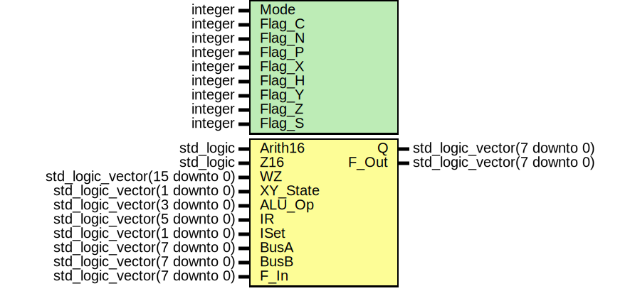

# Entity: T80_ALU

- **File**: T80_ALU.vhd
## Diagram

## Description

****
T80(c) core. Attempt to finish all undocumented features and provide
             accurate timings.
Version 350.
Copyright (c) 2018 Sorgelig
 Test passed: ZEXDOC, ZEXALL, Z80Full(*), Z80memptr
 (*) Currently only SCF and CCF instructions aren't passed X/Y flags check as
     correct implementation is still unclear.
****
T80(b) core. In an effort to merge and maintain bug fixes ....
Ver 301 parity flag is just parity for 8080, also overflow for Z80, by Sean Riddle
Ver 300 started tidyup
MikeJ March 2005
Latest version from www.fpgaarcade.com (original www.opencores.org)
****
Z80 compatible microprocessor core
Version : 0247
Copyright (c) 2001-2002 Daniel Wallner (jesus@opencores.org)
All rights reserved
Redistribution and use in source and synthezised forms, with or without
modification, are permitted provided that the following conditions are met:
Redistributions of source code must retain the above copyright notice,
this list of conditions and the following disclaimer.
Redistributions in synthesized form must reproduce the above copyright
notice, this list of conditions and the following disclaimer in the
documentation and/or other materials provided with the distribution.
Neither the name of the author nor the names of other contributors may
be used to endorse or promote products derived from this software without
specific prior written permission.
THIS SOFTWARE IS PROVIDED BY THE COPYRIGHT HOLDERS AND CONTRIBUTORS "AS IS"
AND ANY EXPRESS OR IMPLIED WARRANTIES, INCLUDING, BUT NOT LIMITED TO,
THE IMPLIED WARRANTIES OF MERCHANTABILITY AND FITNESS FOR A PARTICULAR
PURPOSE ARE DISCLAIMED. IN NO EVENT SHALL THE AUTHOR OR CONTRIBUTORS BE
LIABLE FOR ANY DIRECT, INDIRECT, INCIDENTAL, SPECIAL, EXEMPLARY, OR
CONSEQUENTIAL DAMAGES (INCLUDING, BUT NOT LIMITED TO, PROCUREMENT OF
SUBSTITUTE GOODS OR SERVICES; LOSS OF USE, DATA, OR PROFITS; OR BUSINESS
INTERRUPTION) HOWEVER CAUSED AND ON ANY THEORY OF LIABILITY, WHETHER IN
CONTRACT, STRICT LIABILITY, OR TORT (INCLUDING NEGLIGENCE OR OTHERWISE)
ARISING IN ANY WAY OUT OF THE USE OF THIS SOFTWARE, EVEN IF ADVISED OF THE
POSSIBILITY OF SUCH DAMAGE.
Please report bugs to the author, but before you do so, please
make sure that this is not a derivative work and that
you have the latest version of this file.
The latest version of this file can be found at:
     http://www.opencores.org/cvsweb.shtml/t80/
Limitations :
File history :
     0214 : Fixed mostly flags, only the block instructions now fail the zex regression test
     0238 : Fixed zero flag for 16 bit SBC and ADC
     0240 : Added GB operations
     0242 : Cleanup
     0247 : Cleanup
## Generics

| Generic name | Type    | Value | Description |
| ------------ | ------- | ----- | ----------- |
| Mode         | integer | 0     |             |
| Flag_C       | integer | 0     |             |
| Flag_N       | integer | 1     |             |
| Flag_P       | integer | 2     |             |
| Flag_X       | integer | 3     |             |
| Flag_H       | integer | 4     |             |
| Flag_Y       | integer | 5     |             |
| Flag_Z       | integer | 6     |             |
| Flag_S       | integer | 7     |             |
## Ports

| Port name | Direction | Type                          | Description |
| --------- | --------- | ----------------------------- | ----------- |
| Arith16   | in        | std_logic                     |             |
| Z16       | in        | std_logic                     |             |
| WZ        | in        | std_logic_vector(15 downto 0) |             |
| XY_State  | in        | std_logic_vector(1 downto 0)  |             |
| ALU_Op    | in        | std_logic_vector(3 downto 0)  |             |
| IR        | in        | std_logic_vector(5 downto 0)  |             |
| ISet      | in        | std_logic_vector(1 downto 0)  |             |
| BusA      | in        | std_logic_vector(7 downto 0)  |             |
| BusB      | in        | std_logic_vector(7 downto 0)  |             |
| F_In      | in        | std_logic_vector(7 downto 0)  |             |
| Q         | out       | std_logic_vector(7 downto 0)  |             |
| F_Out     | out       | std_logic_vector(7 downto 0)  |             |
## Signals

| Name        | Type                         | Description                          |
| ----------- | ---------------------------- | ------------------------------------ |
| UseCarry    | std_logic                    | AddSub variables (temporary signals) |
| Carry7_v    | std_logic                    |                                      |
| Overflow_v  | std_logic                    |                                      |
| HalfCarry_v | std_logic                    |                                      |
| Carry_v     | std_logic                    |                                      |
| Q_v         | std_logic_vector(7 downto 0) |                                      |
| BitMask     | std_logic_vector(7 downto 0) |                                      |
## Functions
- AddSub (A        : std_logic_vector;  B        : std_logic_vector;  Sub      : std_logic;  Carry_In : std_logic;  signal Res      : out std_logic_vector;  signal Carry    : out std_logic)  return ()
## Processes
- unnamed: ( Carry_v, Carry7_v, Q_v )
**Description**
bug fix - parity flag is just parity for 8080, also overflow for Z80

- unnamed: ( Arith16, ALU_OP, F_In, BusA, BusB, IR, Q_v, Carry_v, HalfCarry_v, OverFlow_v, BitMask, ISet, Z16, WZ, XY_State )
