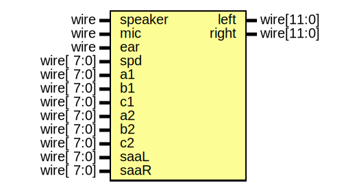

# Entity: audio
## Diagram

## Ports
| Port name | Direction | Type       | Description |
| --------- | --------- | ---------- | ----------- |
| speaker   | input     | wire       |             |
| mic       | input     | wire       |             |
| ear       | input     | wire       |             |
| spd       | input     | wire[ 7:0] |             |
| a1        | input     | wire[ 7:0] |             |
| b1        | input     | wire[ 7:0] |             |
| c1        | input     | wire[ 7:0] |             |
| a2        | input     | wire[ 7:0] |             |
| b2        | input     | wire[ 7:0] |             |
| c2        | input     | wire[ 7:0] |             |
| saaL      | input     | wire[ 7:0] |             |
| saaR      | input     | wire[ 7:0] |             |
| left      | output    | wire[11:0] |             |
| right     | output    | wire[11:0] |             |
## Signals
| Name | Type     | Description |
| ---- | -------- | ----------- |
| ula  | reg[7:0] |             |
## Processes
- unnamed: _( @(*) )_

