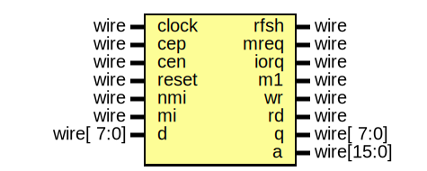

# Entity: cpu

- **File**: cpu.v
## Diagram

## Description

-------------------------------------------------------------------------------------------------

## Ports

| Port name | Direction | Type       | Description |
| --------- | --------- | ---------- | ----------- |
| clock     | input     | wire       |             |
| cep       | input     | wire       |             |
| cen       | input     | wire       |             |
| reset     | input     | wire       |             |
| rfsh      | output    | wire       |             |
| mreq      | output    | wire       |             |
| iorq      | output    | wire       |             |
| nmi       | input     | wire       |             |
| mi        | input     | wire       |             |
| m1        | output    | wire       |             |
| wr        | output    | wire       |             |
| rd        | output    | wire       |             |
| d         | input     | wire[ 7:0] |             |
| q         | output    | wire[ 7:0] |             |
| a         | output    | wire[15:0] |             |
## Instantiations

- Cpu: T80pa
**Description**
-------------------------------------------------------------------------------------------------

