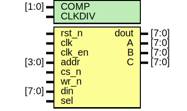

# Entity: jt49

## Diagram

## Description

 Th
 
## Generics

| Generic name | Type  | Value | Description |
| ------------ | ----- | ----- | ----------- |
| COMP         | [1:0] | 2'b00 |             |
| CLKDIV       |       | 3     |             |
## Ports

| Port name | Direction | Type  | Description                               |
| --------- | --------- | ----- | ----------------------------------------- |
| rst_n     | input     |       | note that input ports are not multiplexed |
| clk       | input     |       | signal on positive edge                   |
| clk_en    | input     |       |                                           |
| addr      | input     | [3:0] |                                           |
| cs_n      | input     |       |                                           |
| wr_n      | input     |       | write                                     |
| din       | input     | [7:0] |                                           |
| sel       | input     |       | if sel is low, the clock is divided by 2  |
| dout      | output    | [7:0] |                                           |
| A         | output    | [7:0] | linearised channel output                 |
| B         | output    | [7:0] |                                           |
| C         | output    | [7:0] |                                           |
## Signals

| Name        | Type        | Description          |
| ----------- | ----------- | -------------------- |
| comp        | wire [1:0]  |                      |
| regarray    | reg [7:0]   |                      |
| envelope    | wire [4:0]  |                      |
| bitA        | wire        |                      |
| bitB        | wire        |                      |
| bitC        | wire        |                      |
| noise       | wire        |                      |
| Amix        | reg         |                      |
| Bmix        | reg         |                      |
| Cmix        | reg         |                      |
| cen16       | wire        |                      |
| cen256      | wire        |                      |
| eg_step     | wire        | envelope generator   |
| eg_period   | wire [15:0] |                      |
| null_period | wire        |                      |
| eg_restart  | reg         |                      |
| logA        | reg  [4:0]  |                      |
| logB        | reg  [4:0]  |                      |
| logC        | reg  [4:0]  |                      |
| log         | reg  [4:0]  |                      |
| lin         | wire [7:0]  |                      |
| volA        | wire [4:0]  |                      |
| volB        | wire [4:0]  |                      |
| volC        | wire [4:0]  |                      |
| use_envA    | wire        |                      |
| use_envB    | wire        |                      |
| use_envC    | wire        |                      |
| use_noA     | wire        |                      |
| use_noB     | wire        |                      |
| use_noC     | wire        |                      |
| acc_st      | reg [3:0]   |                      |
| read_mask   | reg [7:0]   |                      |
| write       | wire        | addr register array  |
| last_write  | reg         |                      |
| wr_edge     | wire        |                      |
## Processes
- unnamed: ( @(posedge clk) )
- unnamed: ( @(posedge clk, negedge rst_n) )
- unnamed: ( @(*) )
- unnamed: ( @(posedge clk, negedge rst_n) )
## Instantiations

- u_cen: jt49_cen
- u_chA: jt49_div
**Description**
internal modules operate at clk/16

- u_chB: jt49_div
- u_chC: jt49_div
- u_ng: jt49_noise
- u_envdiv: jt49_div
- u_env: jt49_eg
- u_exp: jt49_exp
