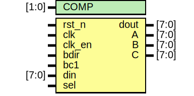

# Entity: jt49_bus

## Diagram

## Description

 Th
 This is a wrapper with the BDIR/BC1 pins    
 
## Generics

| Generic name | Type  | Value | Description |
| ------------ | ----- | ----- | ----------- |
| COMP         | [1:0] | 2'b00 |             |
## Ports

| Port name | Direction | Type  | Description                               |
| --------- | --------- | ----- | ----------------------------------------- |
| rst_n     | input     |       | note that input ports are not multiplexed |
| clk       | input     |       | signal on positive edge                   |
| clk_en    | input     |       |                                           |
| bdir      | input     |       | bus control pins of original chip         |
| bc1       | input     |       |                                           |
| din       | input     | [7:0] |                                           |
| sel       | input     |       | if sel is low, the clock is divided by 2  |
| dout      | output    | [7:0] |                                           |
| A         | output    | [7:0] | linearised channel output                 |
| B         | output    | [7:0] |                                           |
| C         | output    | [7:0] |                                           |
## Signals

| Name      | Type      | Description |
| --------- | --------- | ----------- |
| wr_n      | reg       |             |
| cs_n      | reg       |             |
| addr      | reg [3:0] |             |
| addr_ok   | reg       |             |
| din_latch | reg [7:0] |             |
## Processes
- unnamed: ( @(posedge clk) )
## Instantiations

- u_jt49: jt49
**Description**
note that input ports are not multiplexed
