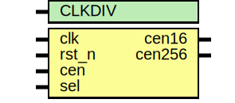

# Entity: jt49_cen

- **File**: jt49_cen.v
## Diagram

## Description

  Th

## Generics

| Generic name | Type | Value | Description                      |
| ------------ | ---- | ----- | -------------------------------- |
| CLKDIV       |      | 3     |  use 3 for standalone JT49 or 2  |
## Ports

| Port name | Direction | Type | Description                     |
| --------- | --------- | ---- | ------------------------------- |
| clk       | input     |      |                                 |
| rst_n     | input     |      |                                 |
| cen       | input     |      | base clock enable signal        |
| sel       | input     |      | when low, divide by 2 once more |
| cen16     | output    |      |                                 |
| cen256    | output    |      |                                 |
## Signals

| Name      | Type           | Description |
| --------- | -------------- | ----------- |
| cencnt    | reg [CLKDIV:0] |             |
| toggle16  | wire           |             |
| toggle256 | wire           |             |
## Constants

| Name | Type | Value  | Description |
| ---- | ---- | ------ | ----------- |
| eg   |      | CLKDIV | 8;          |
## Processes
- unnamed: ( @(posedge clk, negedge rst_n) )
  - **Type:** always
- unnamed: ( @(posedge clk) )
  - **Type:** always
