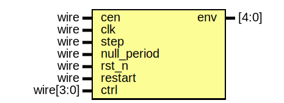

# Entity: jt49_eg

- **File**: jt49_eg.v
## Diagram

## Description

  Th

## Ports

| Port name   | Direction | Type      | Description                                  |
| ----------- | --------- | --------- | -------------------------------------------- |
| cen         | input     | wire      |                                              |
| clk         | input     | wire      | this is the divided down clock from the core |
| step        | input     | wire      |                                              |
| null_period | input     | wire      |                                              |
| rst_n       | input     | wire      |                                              |
| restart     | input     | wire      |                                              |
| ctrl        | input     | wire[3:0] |                                              |
| env         | output    | [4:0]     |                                              |
## Signals

| Name        | Type      | Description |
| ----------- | --------- | ----------- |
| inv         | reg       |             |
| stop        | reg       |             |
| gain        | reg [4:0] |             |
| CONT        | wire      |             |
| ATT         | wire      |             |
| ALT         | wire      |             |
| HOLD        | wire      |             |
| will_hold   | wire      |             |
| last_step   | reg       |             |
| step_edge   | wire      |             |
| will_invert | wire      |             |
| rst_latch   | reg       |             |
| rst_clr     | reg       |             |
## Processes
- unnamed: ( @(posedge clk) )
  - **Type:** always
- unnamed: ( @(posedge clk) )
  - **Type:** always
- unnamed: ( @( posedge clk, negedge rst_n ) )
  - **Type:** always
