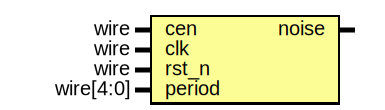

# Entity: jt49_noise

- **File**: jt49_noise.v
## Diagram

## Description

 Th
 
## Ports

| Port name | Direction | Type      | Description |
| --------- | --------- | --------- | ----------- |
| cen       | input     | wire      |             |
| clk       | input     | wire      |             |
| rst_n     | input     | wire      |             |
| period    | input     | wire[4:0] |             |
| noise     | output    |           |             |
## Signals

| Name        | Type      | Description |
| ----------- | --------- | ----------- |
| count       | reg[5:0]  |             |
| poly17      | reg[16:0] |             |
| poly17_zero | wire      |             |
| noise_en    | wire      |             |
| last_en     | reg       |             |
| noise_up    | wire      |             |
## Processes
- unnamed: ( @(posedge clk ) )
- unnamed: ( @( posedge clk, negedge rst_n ) )
## Instantiations

- u_div: jt49_div
