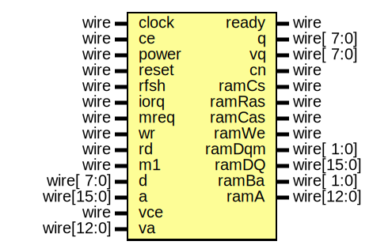

# Entity: memory

- **File**: memory.v
## Diagram

## Description

-------------------------------------------------------------------------------------------------

## Ports

| Port name | Direction | Type       | Description |
| --------- | --------- | ---------- | ----------- |
| clock     | input     | wire       |             |
| ce        | input     | wire       |             |
| power     | input     | wire       |             |
| ready     | output    | wire       |             |
| reset     | input     | wire       |             |
| rfsh      | input     | wire       |             |
| iorq      | input     | wire       |             |
| mreq      | input     | wire       |             |
| wr        | input     | wire       |             |
| rd        | input     | wire       |             |
| m1        | input     | wire       |             |
| d         | input     | wire[ 7:0] |             |
| q         | output    | wire[ 7:0] |             |
| a         | input     | wire[15:0] |             |
| vce       | input     | wire       |             |
| vq        | output    | wire[ 7:0] |             |
| va        | input     | wire[12:0] |             |
| cn        | output    | wire       |             |
| ramCs     | output    | wire       |             |
| ramRas    | output    | wire       |             |
| ramCas    | output    | wire       |             |
| ramWe     | output    | wire       |             |
| ramDqm    | output    | wire[ 1:0] |             |
| ramDQ     | inout     | wire[15:0] |             |
| ramBa     | output    | wire[ 1:0] |             |
| ramA      | output    | wire[12:0] |             |
## Signals

| Name     | Type        | Description                                                                                         |
| -------- | ----------- | --------------------------------------------------------------------------------------------------- |
| vduPage  | reg         | -------------------------------------------------------------------------------------------------
  |
| romPage  | reg         |                                                                                                     |
| noPaging | reg         |                                                                                                     |
| ramPage  | reg[2:0]    |                                                                                                     |
| mapForce | reg         | -------------------------------------------------------------------------------------------------
  |
| mapAuto  | reg         |                                                                                                     |
| mapRam   | reg         |                                                                                                     |
| m1on     | reg         |                                                                                                     |
| mapPage  | reg[3:0]    |                                                                                                     |
| romQ     | wire [ 7:0] | -------------------------------------------------------------------------------------------------
  |
| romA     | wire [14:0] |                                                                                                     |
| esxQ     | wire [ 7:0] | -------------------------------------------------------------------------------------------------
  |
| esxA     | wire [12:0] |                                                                                                     |
| map      | wire        | -------------------------------------------------------------------------------------------------
  |
| page     | wire [3:0]  |                                                                                                     |
| sdrRf    | wire        |                                                                                                     |
| sdrRd    | wire        |                                                                                                     |
| sdrWr    | wire        |                                                                                                     |
| sdrD     | wire [15:0] |                                                                                                     |
| sdrQ     | wire [15:0] |                                                                                                     |
| sdrA     | wire [23:0] |                                                                                                     |
| ramQ     | wire [7:0]  |                                                                                                     |
| va01     | wire        | -------------------------------------------------------------------------------------------------
  |
| va11     | wire        |                                                                                                     |
| dprWe2   | wire        |                                                                                                     |
| dprA1    | wire [13:0] |                                                                                                     |
| dprA2    | wire [13:0] |                                                                                                     |
## Processes
- unnamed: ( @(posedge clock) )
  - **Type:** always
- unnamed: ( @(posedge clock) )
  - **Type:** always
## Instantiations

- Rom: rom
- RomESXDOS: rom
- SDram: sdram
- Dpr: dprs
