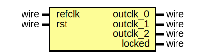

# Entity: pll

- **File**: pll.v
## Diagram

## Description

 megafunction wizard: %Altera PLL v17.1%
 GENERATION: XML
 pll.v
 Generated using ACDS version 17.1 590

## Ports

| Port name | Direction | Type | Description   |
| --------- | --------- | ---- | ------------- |
| refclk    | input     | wire | refclk.clk    |
| rst       | input     | wire | reset.reset   |
| outclk_0  | output    | wire | outclk0.clk   |
| outclk_1  | output    | wire | outclk1.clk   |
| outclk_2  | output    | wire | outclk2.clk   |
| locked    | output    | wire | locked.export |
## Instantiations

- pll_inst: pll_0002
