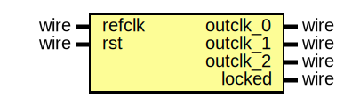

# Entity: pll_0002

- **File**: pll_0002.v
## Diagram

## Ports

| Port name | Direction | Type | Description         |
| --------- | --------- | ---- | ------------------- |
| refclk    | input     | wire | interface 'refclk'  |
| rst       | input     | wire | interface 'reset'   |
| outclk_0  | output    | wire | interface 'outclk0' |
| outclk_1  | output    | wire | interface 'outclk1' |
| outclk_2  | output    | wire | interface 'outclk2' |
| locked    | output    | wire | interface 'locked'  |
## Instantiations

- altera_pll_i: altera_pll
