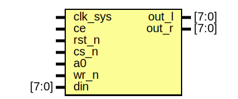

# Entity: saa1099
## Diagram

## Description

  SAA1099 sound generator
  Copyright (C) 2016 Sorgelig
  Based on SAA1099.v code from Miguel Angel Rodriguez Jodar
  Based on SAASound code  from Dave Hooper
  This program is free software; you can redistribute it and/or modify it
  under the terms of the GNU General Public License as published by the Free
  Software Foundation; either version 2 of the License, or (at your option)
  any later version.
  This program is distributed in the hope that it will be useful, but WITHOUT
  ANY WARRANTY; without even the implied warranty of MERCHANTABILITY or
  FITNESS FOR A PARTICULAR PURPOSE.  See the GNU General Public License for
  more details.
  You should have received a copy of the GNU General Public License along
  with this program; if not, write to the Free Software Foundation, Inc.,
  51 Franklin Street, Fifth Floor, Boston, MA 02110-1301 USA.
 
## Ports
| Port name | Direction | Type  | Description       |
| --------- | --------- | ----- | ----------------- |
| clk_sys   | input     |       |                   |
| ce        | input     |       | 8 MHz             |
| rst_n     | input     |       |                   |
| cs_n      | input     |       |                   |
| a0        | input     |       | 0=data, 1=address |
| wr_n      | input     |       |                   |
| din       | input     | [7:0] |                   |
| out_l     | output    | [7:0] |                   |
| out_r     | output    | [7:0] |                   |
## Signals
| Name        | Type        | Description |
| ----------- | ----------- | ----------- |
| amplit0     | reg [7:0]   |             |
| amplit1     | reg [7:0]   |             |
| amplit2     | reg [7:0]   |             |
| amplit3     | reg [7:0]   |             |
| amplit4     | reg [7:0]   |             |
| amplit5     | reg [7:0]   |             |
| freq0       | reg [7:0]   |             |
| freq1       | reg [7:0]   |             |
| freq2       | reg [7:0]   |             |
| freq3       | reg [7:0]   |             |
| freq4       | reg [7:0]   |             |
| freq5       | reg [7:0]   |             |
| oct10       | reg [7:0]   |             |
| oct32       | reg [7:0]   |             |
| oct54       | reg [7:0]   |             |
| freqenable  | reg [7:0]   |             |
| noiseenable | reg [7:0]   |             |
| noisegen    | reg [7:0]   |             |
| envelope0   | reg [7:0]   |             |
| envelope1   | reg [7:0]   |             |
| ctrl        | reg [7:0]   |             |
| addr        | reg [4:0]   |             |
| rst         | wire        |             |
| wr          | reg         |             |
| out0        | wire [21:0] |             |
| out1        | wire [21:0] |             |
## Processes
- unnamed: _( @(posedge clk_sys) )_

## Instantiations
- top: saa1099_triplet
- bottom: saa1099_triplet
- outmix_l: saa1099_output_mixer
- outmix_r: saa1099_output_mixer
