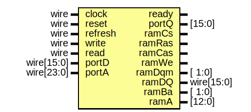
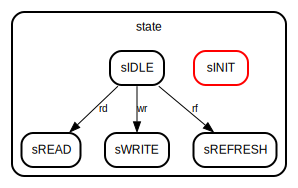

# Entity: sdram
## Diagram

## Ports
| Port name | Direction | Type       | Description |
| --------- | --------- | ---------- | ----------- |
| clock     | input     | wire       |             |
| reset     | input     | wire       |             |
| ready     | output    |            |             |
| refresh   | input     | wire       |             |
| write     | input     | wire       |             |
| read      | input     | wire       |             |
| portD     | input     | wire[15:0] |             |
| portQ     | output    | [15:0]     |             |
| portA     | input     | wire[23:0] |             |
| ramCs     | output    |            |             |
| ramRas    | output    |            |             |
| ramCas    | output    |            |             |
| ramWe     | output    |            |             |
| ramDqm    | output    | [ 1:0]     |             |
| ramDQ     | inout     | wire[15:0] |             |
| ramBa     | output    | [ 1:0]     |             |
| ramA      | output    | [12:0]     |             |
## Signals
| Name     | Type      | Description |
| -------- | --------- | ----------- |
| ramQ     | reg[15:0] |             |
| rs       | reg       |             |
| rs2      | reg       |             |
| rd       | reg       |             |
| rd2      | reg       |             |
| wr       | reg       |             |
| wr2      | reg       |             |
| rf       | reg       |             |
| rf2      | reg       |             |
| counting | reg       |             |
| count    | reg[5:0]  |             |
| state    | reg[2:0]  |             |
## Constants
| Name     | Type | Value | Description |
| -------- | ---- | ----- | ----------- |
| sINIT    |      | 0     |             |
| sIDLE    |      | 1     |             |
| sREAD    |      | 2     |             |
| sWRITE   |      | 3     |             |
| sREFRESH |      | 4     |             |
## Processes
- unnamed: _( @(negedge clock) )_

- unnamed: _( @(posedge clock) )_

## State machines
