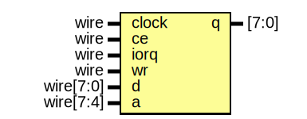

# Entity: specdrum

- **File**: specdrum.v
## Diagram

## Description

-------------------------------------------------------------------------------------------------

## Ports

| Port name | Direction | Type      | Description |
| --------- | --------- | --------- | ----------- |
| clock     | input     | wire      |             |
| ce        | input     | wire      |             |
| iorq      | input     | wire      |             |
| wr        | input     | wire      |             |
| d         | input     | wire[7:0] |             |
| q         | output    | [7:0]     |             |
| a         | input     | wire[7:4] |             |
## Processes
- unnamed: ( @(posedge clock) )
  - **Type:** always
**Description**
-------------------------------------------------------------------------------------------------
 
