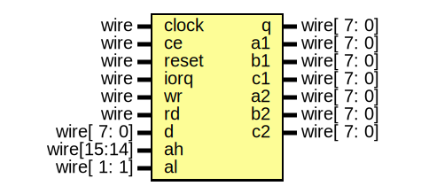

# Entity: turbosound

- **File**: turbosound.v
## Diagram

## Description

-------------------------------------------------------------------------------------------------

## Ports

| Port name | Direction | Type        | Description |
| --------- | --------- | ----------- | ----------- |
| clock     | input     | wire        |             |
| ce        | input     | wire        |             |
| reset     | input     | wire        |             |
| iorq      | input     | wire        |             |
| wr        | input     | wire        |             |
| rd        | input     | wire        |             |
| d         | input     | wire[ 7: 0] |             |
| q         | output    | wire[ 7: 0] |             |
| ah        | input     | wire[15:14] |             |
| al        | input     | wire[ 1: 1] |             |
| a1        | output    | wire[ 7: 0] |             |
| b1        | output    | wire[ 7: 0] |             |
| c1        | output    | wire[ 7: 0] |             |
| a2        | output    | wire[ 7: 0] |             |
| b2        | output    | wire[ 7: 0] |             |
| c2        | output    | wire[ 7: 0] |             |
## Signals

| Name  | Type       | Description                                                                                         |
| ----- | ---------- | --------------------------------------------------------------------------------------------------- |
| bdir  | wire       | -------------------------------------------------------------------------------------------------
  |
| bc1   | wire       |                                                                                                     |
| psgQ  | wire [7:0] |                                                                                                     |
| sel   | reg        |                                                                                                     |
| bdir1 | wire       | -------------------------------------------------------------------------------------------------
  |
| bc11  | wire       |                                                                                                     |
| q1    | wire [7:0] |                                                                                                     |
| bdir2 | wire       | -------------------------------------------------------------------------------------------------
  |
| bc12  | wire       |                                                                                                     |
| q2    | wire [7:0] |                                                                                                     |
## Processes
- unnamed: ( @(posedge clock) )
  - **Type:** always
## Instantiations

- Psg1: jt49_bus
- Psg2: jt49_bus
