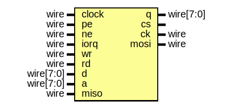

# Entity: usd

## Diagram

## Ports

| Port name | Direction | Type      | Description |
| --------- | --------- | --------- | ----------- |
| clock     | input     | wire      |             |
| pe        | input     | wire      |             |
| ne        | input     | wire      |             |
| iorq      | input     | wire      |             |
| wr        | input     | wire      |             |
| rd        | input     | wire      |             |
| d         | input     | wire[7:0] |             |
| q         | output    | wire[7:0] |             |
| a         | input     | wire[7:0] |             |
| cs        | output    |           |             |
| ck        | output    | wire      |             |
| miso      | input     | wire      |             |
| mosi      | output    | wire      |             |
## Signals

| Name | Type | Description |
| ---- | ---- | ----------- |
| iotx | wire |             |
| iorx | wire |             |
| tx   | reg  |             |
| dtx  | reg  |             |
| rx   | reg  |             |
| drx  | reg  |             |
## Processes
- unnamed: ( @(posedge clock) )
- unnamed: ( @(posedge clock) )
## Instantiations

- Spi: spi
