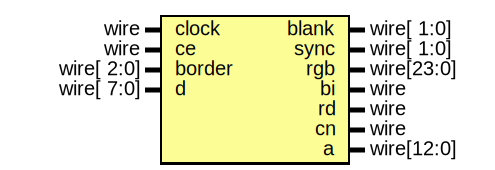

# Entity: video

## Diagram

## Ports

| Port name | Direction | Type       | Description |
| --------- | --------- | ---------- | ----------- |
| clock     | input     | wire       |             |
| ce        | input     | wire       |             |
| border    | input     | wire[ 2:0] |             |
| blank     | output    | wire[ 1:0] |             |
| sync      | output    | wire[ 1:0] |             |
| rgb       | output    | wire[23:0] |             |
| bi        | output    | wire       |             |
| rd        | output    | wire       |             |
| cn        | output    | wire       |             |
| d         | input     | wire[ 7:0] |             |
| a         | output    | wire[12:0] |             |
## Signals

| Name            | Type     | Description |
| --------------- | -------- | ----------- |
| hCount          | reg[8:0] |             |
| hCountReset     | wire     |             |
| vCount          | reg[8:0] |             |
| vCountReset     | wire     |             |
| fCount          | reg[4:0] |             |
| dataEnable      | wire     |             |
| videoEnable     | reg      |             |
| videoEnableLoad | wire     |             |
| dataInput       | reg[7:0] |             |
| dataInputLoad   | wire     |             |
| attrInput       | reg[7:0] |             |
| attrInputLoad   | wire     |             |
| dataOutput      | reg[7:0] |             |
| dataOutputLoad  | wire     |             |
| attrOutput      | reg[7:0] |             |
| attrOutputLoad  | wire     |             |
| dataSelect      | wire     |             |
| r               | wire     |             |
| g               | wire     |             |
| b               | wire     |             |
| i               | wire     |             |
## Processes
- unnamed: ( @(posedge clock) )
- unnamed: ( @(posedge clock) )
- unnamed: ( @(posedge clock) )
- unnamed: ( @(posedge clock) )
- unnamed: ( @(posedge clock) )
- unnamed: ( @(posedge clock) )
- unnamed: ( @(posedge clock) )
- unnamed: ( @(posedge clock) )
