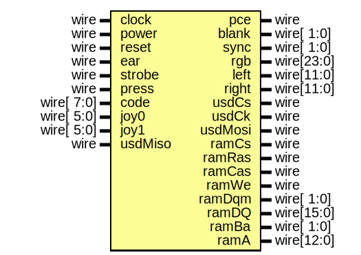

# Entity: zx128

- **File**: zx128.v
## Diagram

## Description

-------------------------------------------------------------------------------------------------

## Ports

| Port name | Direction | Type       | Description |
| --------- | --------- | ---------- | ----------- |
| clock     | input     | wire       | 56.7504 MHz |
| pce       | output    | wire       | pixel ce    |
| power     | input     | wire       |             |
| reset     | input     | wire       |             |
| blank     | output    | wire[ 1:0] | video       |
| sync      | output    | wire[ 1:0] |             |
| rgb       | output    | wire[23:0] |             |
| ear       | input     | wire       | audio       |
| left      | output    | wire[11:0] |             |
| right     | output    | wire[11:0] |             |
| strobe    | input     | wire       | keyboard    |
| press     | input     | wire       |             |
| code      | input     | wire[ 7:0] |             |
| joy0      | input     | wire[ 5:0] | joystick    |
| joy1      | input     | wire[ 5:0] |             |
| usdCs     | output    | wire       | sd          |
| usdCk     | output    | wire       |             |
| usdMiso   | input     | wire       |             |
| usdMosi   | output    | wire       |             |
| ramCs     | output    | wire       | sdram       |
| ramRas    | output    | wire       |             |
| ramCas    | output    | wire       |             |
| ramWe     | output    | wire       |             |
| ramDqm    | output    | wire[ 1:0] |             |
| ramDQ     | inout     | wire[15:0] |             |
| ramBa     | output    | wire[ 1:0] |             |
| ramA      | output    | wire[12:0] |             |
## Signals

| Name           | Type         | Description                                                                                                                                                                                                                                                                                                                                                                                                   |
| -------------- | ------------ | ------------------------------------------------------------------------------------------------------------------------------------------------------------------------------------------------------------------------------------------------------------------------------------------------------------------------------------------------------------------------------------------------------------- |
| ce             | reg[3:0]     | -------------------------------------------------------------------------------------------------
                                                                                                                                                                                                                                                                                                            |
| pe7M0          | wire         |                                                                                                                                                                                                                                                                                                                                                                                                               |
| ne7M0          | wire         |                                                                                                                                                                                                                                                                                                                                                                                                               |
| pe3M5          | wire         |                                                                                                                                                                                                                                                                                                                                                                                                               |
| ne3M5          | wire         |                                                                                                                                                                                                                                                                                                                                                                                                               |
| mreqt23iorqtw3 | reg          | -------------------------------------------------------------------------------------------------
                                                                                                                                                                                                                                                                                                            |
| cpuck          | reg          |                                                                                                                                                                                                                                                                                                                                                                                                               |
| contend        | wire         |                                                                                                                                                                                                                                                                                                                                                                                                               |
| pc3M5          | wire         |                                                                                                                                                                                                                                                                                                                                                                                                               |
| nc3M5          | wire         |                                                                                                                                                                                                                                                                                                                                                                                                               |
| rst            | wire         | -------------------------------------------------------------------------------------------------
                                                                                                                                                                                                                                                                                                            |
| nmi            | wire         |                                                                                                                                                                                                                                                                                                                                                                                                               |
| mi             | reg          |                                                                                                                                                                                                                                                                                                                                                                                                               |
| d              | wire [ 7:0]  |                                                                                                                                                                                                                                                                                                                                                                                                               |
| q              | wire [ 7:0]  |                                                                                                                                                                                                                                                                                                                                                                                                               |
| a              | wire [15:0]  |                                                                                                                                                                                                                                                                                                                                                                                                               |
| mic            | reg          | -------------------------------------------------------------------------------------------------
                                                                                                                                                                                                                                                                                                            |
| speaker        | reg          |                                                                                                                                                                                                                                                                                                                                                                                                               |
| border         | reg[2:0]     |                                                                                                                                                                                                                                                                                                                                                                                                               |
| memQ           | wire [ 7:0]  | -------------------------------------------------------------------------------------------------
                                                                                                                                                                                                                                                                                                            |
| vq             | wire [ 7:0]  |                                                                                                                                                                                                                                                                                                                                                                                                               |
| va             | wire [12:0]  |                                                                                                                                                                                                                                                                                                                                                                                                               |
| spdQ           | wire [7:0]   | -------------------------------------------------------------------------------------------------
                                                                                                                                                                                                                                                                                                            |
| psgA1          | wire [7:0]   |                                                                                                                                                                                                                                                                                                                                                                                                               |
| psgB1          | wire [7:0]   |                                                                                                                                                                                                                                                                                                                                                                                                               |
| psgC1          | wire [7:0]   |                                                                                                                                                                                                                                                                                                                                                                                                               |
| psgA2          | wire [7:0]   |                                                                                                                                                                                                                                                                                                                                                                                                               |
| psgB2          | wire [7:0]   |                                                                                                                                                                                                                                                                                                                                                                                                               |
| psgC2          | wire [7:0]   |                                                                                                                                                                                                                                                                                                                                                                                                               |
| saaL           | wire [7:0]   |                                                                                                                                                                                                                                                                                                                                                                                                               |
| saaR           | wire [7:0]   |                                                                                                                                                                                                                                                                                                                                                                                                               |
| keyQ           | wire [4:0]   | -------------------------------------------------------------------------------------------------
                                                                                                                                                                                                                                                                                                            |
| keyA           | wire [7:0]   |                                                                                                                                                                                                                                                                                                                                                                                                               |
| usdQ           | wire [7:0]   | -------------------------------------------------------------------------------------------------
  reg[7:0] mx;
 reg[7:0] my;
  always @(posedge clock) if(mouses)
 begin
 	mx <= mx+(mousex[7:0]-(mousex[8] ? 9'h100 : 9'h000));
 	my <= my+(mousey[7:0]-(mousey[8] ? 9'h100 : 9'h000));
 end
 */ -------------------------------------------------------------------------------------------------
  |
| usdA           | wire [7:0]   |                                                                                                                                                                                                                                                                                                                                                                                                               |
| spdA           | wire [7:4]   | -------------------------------------------------------------------------------------------------
                                                                                                                                                                                                                                                                                                            |
| psgQ           | wire [ 7: 0] | -------------------------------------------------------------------------------------------------
                                                                                                                                                                                                                                                                                                            |
| psgAh          | wire [15:14] |                                                                                                                                                                                                                                                                                                                                                                                                               |
| psgAl          | wire [ 1: 1] |                                                                                                                                                                                                                                                                                                                                                                                                               |
| saac           | reg[2:0]     | -------------------------------------------------------------------------------------------------
                                                                                                                                                                                                                                                                                                            |
| saace          | wire         |                                                                                                                                                                                                                                                                                                                                                                                                               |
| ioFE           | wire         | ula                                                                                                                                                                                                                                                                                                                                                                                                           |
| ioDF           | wire         | kempston                                                                                                                                                                                                                                                                                                                                                                                                      |
| ioEB           | wire         | usd                                                                                                                                                                                                                                                                                                                                                                                                           |
| ioFF           | wire         | saa                                                                                                                                                                                                                                                                                                                                                                                                           |
| ioFFFD         | wire         | psg                                                                                                                                                                                                                                                                                                                                                                                                           |
| io7FFD         | wire         | paging                                                                                                                                                                                                                                                                                                                                                                                                        |
## Processes
- unnamed: ( @(negedge clock) )
  - **Type:** always
- unnamed: ( @(posedge clock) )
  - **Type:** always
- unnamed: ( @(posedge clock) )
  - **Type:** always
- unnamed: ( @(posedge clock) )
  - **Type:** always
- unnamed: ( @(posedge clock) )
  - **Type:** always
- unnamed: ( @(posedge clock) )
  - **Type:** always
## Instantiations

- Cpu: cpu
- Memory: memory
- Video: video
 **Description**
-------------------------------------------------------------------------------------------------

- Audio: audio
- Keyboard: keyboard
- uSD: usd
- Specdrum: specdrum
- Turbosound: turbosound
- saa1099: saa1099
